# 🔬 GaugeGap Foundry

> **Verification-first AI-for-science infrastructure for finite, reproducible, theorem-adjacent experiments.**

<p align="center">
  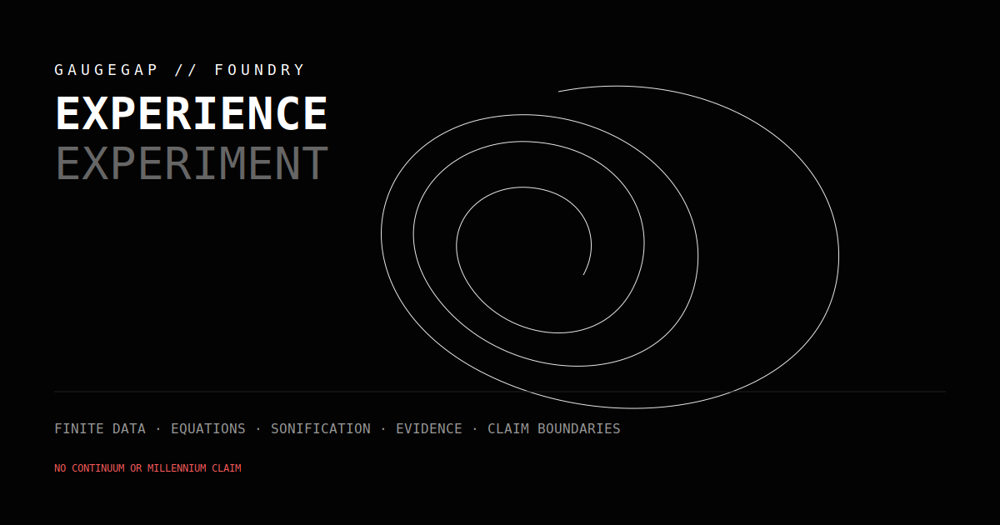
  <br/>
  <em>Finite data becomes an audiovisual experience; every scene opens back into equations, diagnostics, provenance, and explicit claim boundaries.</em>
</p>

<p align="center">
  <a href="#%EF%B8%8F-foundry-experience--experience--experiment">Foundry Experience</a> ·
  <a href="#-lagrangian-forge--from-symmetry-to-matter">Lagrangian Forge</a> ·
  <a href="#-attractor-forge--nonlinear-dynamics-you-can-inspect">Attractor Forge</a> ·
  <a href="#-the-web-of-physical-limits">Physical limits</a> ·
  <a href="#-the-web-of-inference-traps">Inference traps</a> ·
  <a href="#%EF%B8%8F-gaugegap-track--finite-gauge-system-benchmarks">Gauge systems</a> ·
  <a href="#-curverank-track--riemann-adjacent-spectral-screening">Spectral screening</a> ·
  <a href="#-run-the-foundry">Run the Foundry</a>
</p>

<p align="center">
  
  
  
  
  
  
</p>

---

## 🎯 What this repository is

GaugeGap Foundry is a single laboratory for several kinds of finite scientific experiments:

- **Foundry Experience** — a dependency-free audiovisual interface with separate immersion and apparatus modes.
- **Lagrangian Forge** — an audited Standard Model field, sector, interaction, and tree-level mass atlas.
- **GaugeGap** — finite lattice-gauge benchmarks from Z₂ through bounded SU(3) scaffolds.
- **FlowGap** — finite PDE surrogates and nonlinear systems, including Rössler, Lorenz, and Thomas dynamics.
- **CurveRank** — certified screening of finite operator truncations against zeta-zero-inspired targets.
- **Physical limits** — familiar physics claims reduced to their exact, bounded computational core.
- **Spectra and Verdict DSLs** — small languages where certification and evidence are part of program semantics.

> ⚠️ **Claim boundary:** this repository does **not** claim a solution to any Millennium Prize problem. A finite numerical experiment, a formal inequality, a symbolic catalog, and a continuum theorem are different achievements and are labelled separately throughout the project.

<details open>
<summary><strong>🗺️ Open the Foundry map</strong></summary>

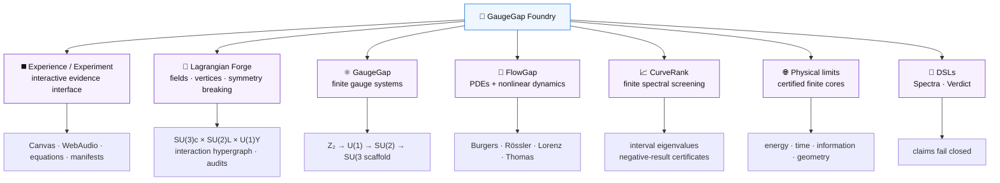

</details>

---

## ◼️ Foundry Experience — experience ↔ experiment

The repository has a self-contained browser interface inspired by the conceptual split between Ryoji Ikeda's **`supersymmetry [experience]`** and **`supersymmetry [experiment]`**: one mode emphasizes immersion, while the other exposes apparatus, controls, evidence, and process. The implementation does not copy the original artwork, sound, photography, or software.

<p align="center">
  
</p>

| Mode | Purpose | What appears |
|---|---|---|
| **Experience** | sensory traversal of verified finite data | auto-cycling scenes, progressive trajectories, rotating geometry, equation fields, scan fields, WebAudio sonification, live schema and commit ticker |
| **Experiment** | inspect and manipulate the apparatus | equations, ODE and Standard Model parameter sliders, browser-side RK4 reintegration, projections, DMD diagnostics, interval-step status, Lagrangian audits, Hamiltonian audits, provenance, claim boundaries |

Eight scenes ship in the complete generated bundle:

1. Rössler dynamics;
2. Lorenz dynamics;
3. Thomas cyclic dynamics;
4. finite gauge lattice with highlighted Wilson-loop path;
5. exact finite SU(3) octet/decuplet weight geometry;
6. Lagrangian Forge interaction graph, equation wall, symmetry-breaking view, and vertex atlas;
7. canonical Z₂ and truncated U(1) spectra;
8. dimensionless Compton–Schwarzschild mass-radius limits.

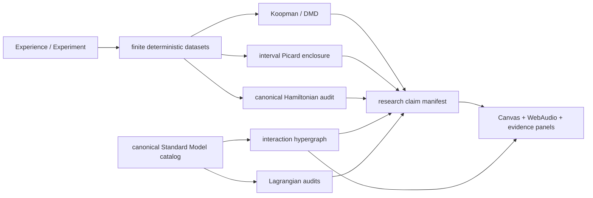

<details open>
<summary><strong>▶️ Generate and open the complete interface</strong></summary>

```bash
foundry run foundry-experience-v2
# focused alias
foundry run lagrangian-forge
```

The original seven-scene generator remains available as the stable base implementation:

```bash
foundry run foundry-experience
# or
make experience
```

Then open:

```text
site/foundry-experience/index.html
```

The generated site uses only HTML, CSS, Canvas, vanilla JavaScript, and optional WebAudio. It has no CDN or external JavaScript dependency.

Run the cross-track integration benchmark:

```bash
foundry run deep-boil-smoke
foundry run deep-boil-0001
# or
make deep-boil
```

</details>

The supporting substrate is reusable outside the interface:

- `src/gaugegap/koopman.py` — exact finite-data DMD, delay embeddings, dominant-mode summaries;
- `src/gaugegap/validated_dynamics.py` — Picard-inclusion interval steps for Rössler, Lorenz, and Thomas;
- `src/gaugegap/hamiltonian_factory.py` — canonical finite Hamiltonian construction and Hermiticity/gap audits;
- `src/gaugegap/standard_model_catalog.py` — canonical Standard Model sectors, fields, interactions, controls, and tree-level relations;
- `src/gaugegap/interaction_graph.py` — deterministic interaction hypergraph;
- `src/gaugegap/lagrangian_audit.py` — fail-closed charge, dimension, reference, mixing, and source-boundary audits;
- `src/gaugegap/research_manifest.py` — fail-closed claim levels tied to hashed evidence artifacts.

📖 [`docs/foundry-experience.md`](docs/foundry-experience.md) · 🧬 [`docs/lagrangian-forge.md`](docs/lagrangian-forge.md) · ✅ [`docs/deep-boil-verification.md`](docs/deep-boil-verification.md)

> 🧭 **Boundary:** the interface communicates and explores finite computations and canonical symbolic structure. It does not turn visual complexity, generated sound, a finite-time Lyapunov estimate, a finite lattice gap, or a tree-level Standard Model catalog into a continuum theorem.

---

## 🧬 Lagrangian Forge — from symmetry to matter

Lagrangian Forge turns the visual density of a full expanded Standard Model blackboard into an inspectable scientific system. The artistic blackboard is inspiration only; the source of truth is the compact canonical sector decomposition.

```text
SU(3)c × SU(2)L × U(1)Y
        ↓ fields + interactions
      electroweak breaking
        ↓ masses + vertices
      finite audited scene
```

The four browser views are:

| Selector | View |
|---|---|
| `x / y` | interaction hypergraph |
| `x / z` | animated equation wall |
| `y / z` | electroweak symmetry breaking and tree-level masses |
| `rotating 3-D` | vertex atlas |

The scene audits unique identifiers, field and sector references, electric-charge conservation, operator dimensions, Hermitian partner declarations, coupling labels, finite parameters, neutral mass-matrix symmetry, the tree-level massless photon, photon/Z mixing orthogonality, and explicit source and gauge-convention boundaries.

```bash
foundry run lagrangian-forge
```

> 🧭 **Boundary:** this is a finite symbolic catalog, interaction graph, structural audit, and tree-level calculator—not a scattering-amplitude engine, loop calculation, path-integral evaluation, nonperturbative continuum construction, or Yang–Mills mass-gap proof.

---

## 🌀 Attractor Forge — nonlinear dynamics you can inspect

Attractor Forge is the FlowGap nonlinear-dynamics laboratory. It does more than draw a familiar spiral or butterfly: each run produces a complete finite evidence bundle.

<p align="center">
  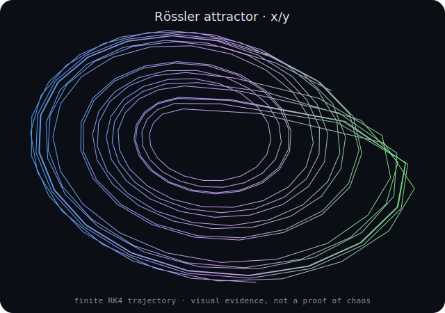
</p>

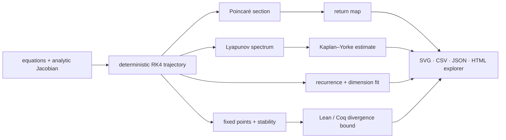

| System | Default finite model | Exact divergence statement | Formal boundary |
|---|---|---|---|
| **Rössler** | `a=0.2, b=0.2, c=5.7` | `div f = a + x − c` | contraction is certified only in the stated region |
| **Lorenz** | `σ=10, ρ=28, β=8/3` | `div f = −(σ+1+β)` | global volume contraction for non-negative `σ, β` |
| **Thomas** | `b=0.208186` | `div f = −3b` | global volume contraction for `b>0` |

A full run emits:

- deterministic trajectory and sampled phase projections;
- fixed-point residuals and Jacobian eigenvalues;
- linearly interpolated Poincaré crossings and a return map;
- all three finite-time Lyapunov exponents using variational QR evolution;
- Kaplan–Yorke dimension estimate;
- `dt`, `dt/2`, `dt/4` short-horizon consistency checks;
- nearby-trajectory sensitivity and threshold-crossing time;
- FFT peaks, recurrence rate, and correlation-dimension fit quality;
- optional bifurcation-style parameter sweeps;
- SVG figures, CSV data, JSON summary, JSONL ledger, hashes, report, and a self-contained rotating HTML explorer;
- hole-free Lean and Coq source for the exact divergence inequality being claimed.

<details>
<summary><strong>▶️ Run Rössler, Lorenz, or Thomas</strong></summary>

```bash
foundry run flowgap-0002-rossler
foundry run flowgap-0003-lorenz
foundry run flowgap-0004-thomas

# all three
foundry run attractor-forge
```

Custom Rössler run:

```bash
python scripts/run_attractor_forge.py \
  --system rossler \
  --params a=0.2,b=0.2,c=5.7 \
  --dt 0.01 \
  --steps 30000 \
  --transient 5000 \
  --lyapunov-steps 30000 \
  --bifurcation-points 24 \
  --output-dir results/flowgap-0002-attractor-forge
```

Open `attractor_explorer.html` inside the result directory for the rotating 3-D view.

</details>

> 🧭 **Boundary:** a positive finite-time Lyapunov estimate, a fractal-looking projection, or a good correlation-dimension fit is numerical evidence for the configured finite integration. It is not a formal proof of a global strange attractor, ergodicity, or chaos in the continuum system. See [`docs/attractor-forge.md`](docs/attractor-forge.md).

---

## 🌐 The web of physical limits

Each member begins with a popular physics claim and strips it down to the one genuine, exactly computable statement it contains. That statement is then reproduced numerically and, where supported, emitted as a discharged Lean 4 / Coq inequality and independently rechecked.

<p align="center">
  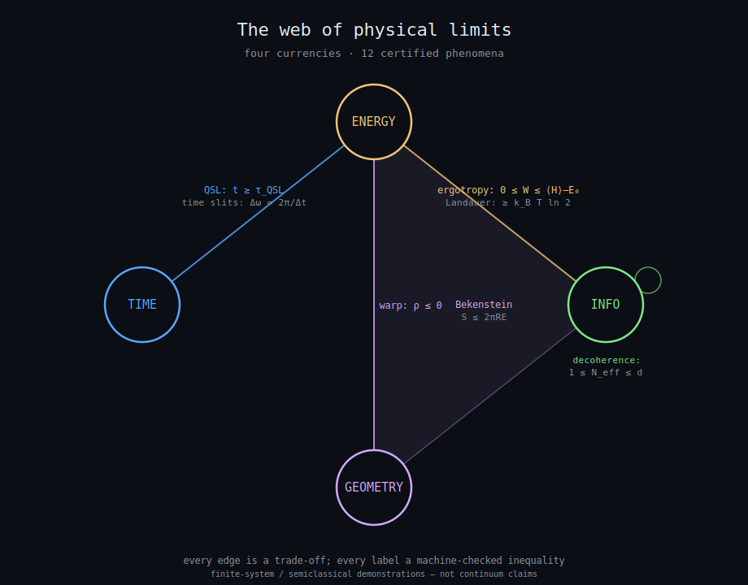
</p>

| Member | Currencies | Certified finite statement |
|---|---|---|
| Quantum speed limit | time ↔ energy | `t ≥ τ_QSL` |
| Temporal double slit | time ↔ frequency | `Δω = 2π/Δt`, `σ_t σ_ω ≥ ½` |
| Sonification / sampling | time ↔ frequency | aliasing fold `0 < f_s − f < f_s/2` |
| Ergotropy / passivity | work ↔ entropy | `0 ≤ W ≤ ⟨H⟩ − E₀` |
| Decoherence / branching | information | `1 ≤ N_eff ≤ d` |
| Landauer principle | information ↔ energy | `W ≥ k_B T ln 2` |
| Bekenstein bound | information ↔ energy ↔ geometry | `S ≤ 2πRE` |
| Alcubierre energy condition | energy ↔ geometry | `ρ ≤ 0` in the displayed model |
| Cherenkov cone | velocity ↔ geometry | `cos θc = 1/(nβ)`, `β > 1/n` |
| Lieb–Robinson cone | information ↔ time | `x(t) ≤ v_LR t + ξ` |
| Compton–Schwarzschild | mass ↔ geometry | `R² ≥ R_s λ_C = 2ℓ_P²` |
| Quantum Zeno effect | measurement ↔ time | survival `≥ 1 − (ΔE T)²/N` |

### The cosmic mass–radius boundary

Plot objects by mass and radius and two limits seal off the lower-left region: compress past the Schwarzschild radius and the object is inside a horizon; localize below the Compton wavelength and the single-particle description breaks down. Their crossing identifies the Planck-scale region.

<p align="center">
  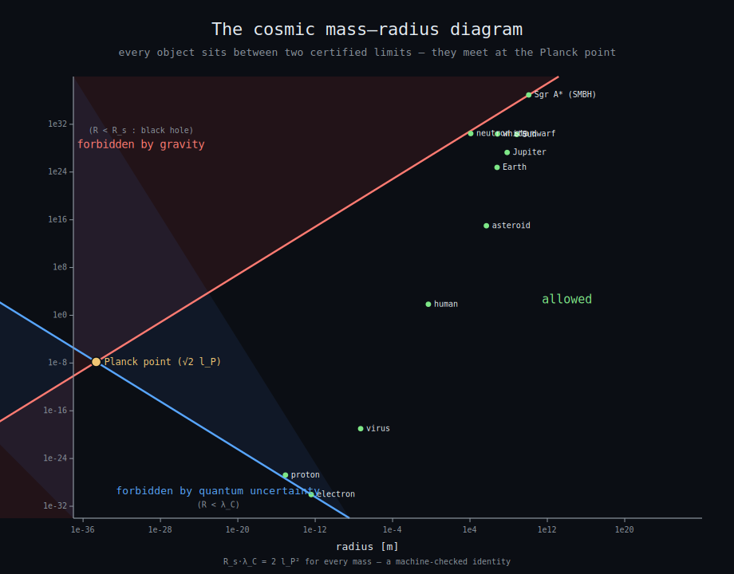
</p>

### The certificate ladder

<p align="center">
  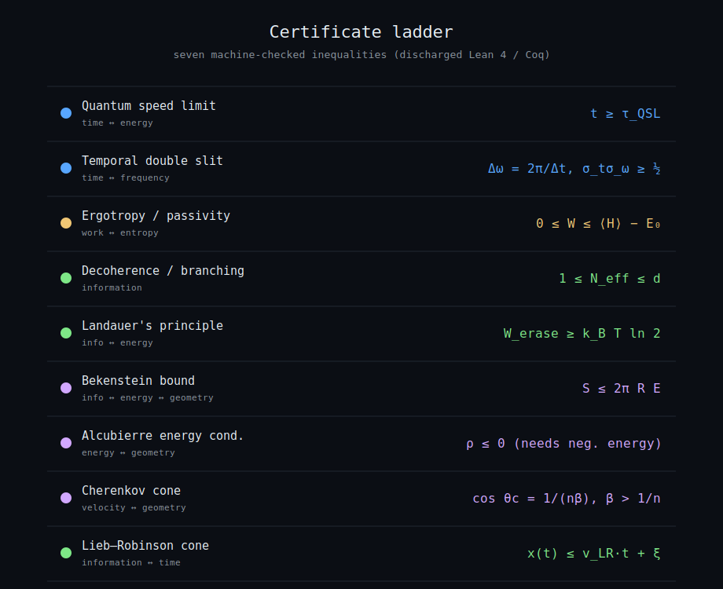
</p>

<details>
<summary><strong>📜 What one emitted certificate looks like</strong></summary>

```coq
Require Import Reals. Require Import Lra. Open Scope R_scope.
Section ComptonSchwarzschild_Planck.
Variables Rad Rs Lc : R.
Hypothesis Rad_nonneg : Rad >= 0.
Hypothesis Rs_pos : Rs > 0.
Hypothesis Lc_pos : Lc > 0.
Hypothesis not_bh : Rad >= Rs.
Hypothesis localizable : Rad >= Lc.
Theorem planck_floor : Rad * Rad >= Rs * Lc.
Proof. nra. Qed.
End ComptonSchwarzschild_Planck.
```

The assumptions are visible. The theorem does not silently claim more than those assumptions support.

</details>

### 🖼️ Physical-limits gallery

| | | |
|:---:|:---:|:---:|
| 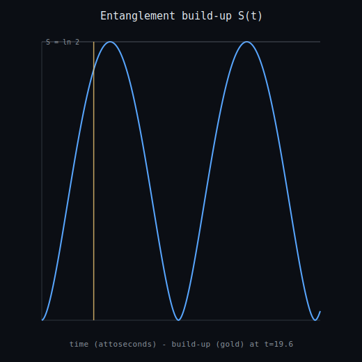<br/>**Entanglement build-up** | <br/>**Quantum speed-limit floor** | <br/>**Temporal diffraction** |
| <br/>**Decoherence branches** | 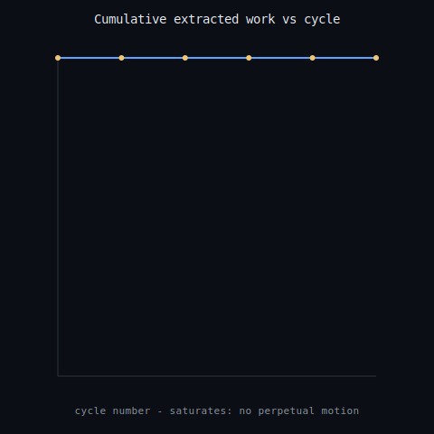<br/>**Extractable work saturates** | 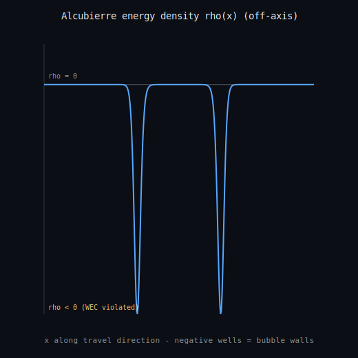<br/>**Warp profile requires negative energy density** |
| 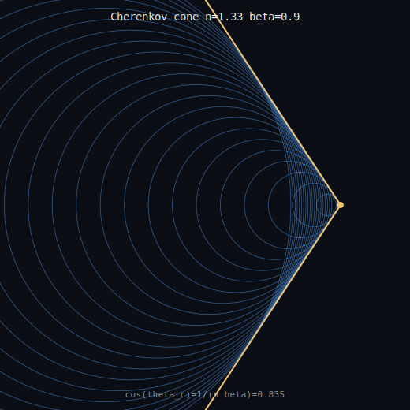<br/>**Cherenkov cone** | 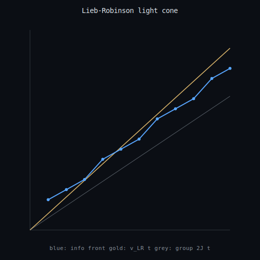<br/>**Lieb–Robinson cone** | <br/>**Mass–radius floor** |

📖 [`docs/physical-limits-web.md`](docs/physical-limits-web.md) · 🧭 [`docs/epistemics-and-claim-boundaries.md`](docs/epistemics-and-claim-boundaries.md) · 🖼️ [`figures/physical-limits/`](figures/physical-limits/)

> 🧭 **Boundary:** these are finite-system or semiclassical demonstrations of established bounds—not a buildable warp drive, free-energy device, or continuum theorem.

---

## 🎲 The web of inference traps

The same verification discipline applied to statistics and decision theory: famous puzzles are reduced to exact bounded calculations rather than hand-waving or Monte Carlo alone.

<p align="center">
  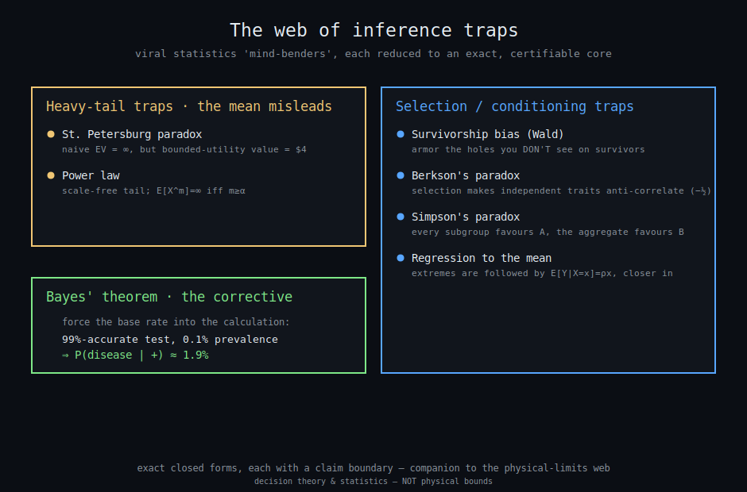
</p>

| Trap | Family | Exactly computable core |
|---|---|---|
| St. Petersburg paradox | heavy tail | truncated EV grows; bounded-utility certainty equivalent remains finite |
| Power law | heavy tail | scale-free tail and moment-divergence threshold |
| Regression to the mean | conditioning | `E[Y|X=x]=ρx` |
| Survivorship bias | selection | survivor hit-rate reverses the naive armour conclusion |
| Berkson paradox | collider | independent traits anti-correlate after selection |
| Simpson paradox | confounding | subgroup and aggregate directions can reverse |
| Bayes theorem | correction | base rates dominate apparently accurate tests |

<details>
<summary><strong>🎲 Run several traps yourself</strong></summary>

```python
>>> from gaugegap.decision.bayes import analyze_bayes
>>> analyze_bayes().posterior_positive
0.0194...  # 99% test, 0.1% prevalence: the posterior is about 1.9%

>>> from gaugegap.decision.st_petersburg import analyze_st_petersburg
>>> result = analyze_st_petersburg()
>>> result.truncated_ev_sample[40], round(result.log_utility_certainty_equivalent, 6)
(40.0, 4.0)

>>> from gaugegap.decision.berksons_paradox import selected_correlation
>>> selected_correlation(0.5, 0.5)
-0.5
```

</details>

📖 [`docs/inference-traps.md`](docs/inference-traps.md)

> 🧭 **Boundary:** exact textbook decision-theory demonstrations—not financial, medical, or behavioural advice.

---

## 🧊 Superconducting qubits — certified from first principles

A plain LC circuit has equally spaced energy levels, making `0→1` hard to address independently from `1→2`. A Josephson junction introduces the nonlinear term that creates anharmonicity:

```text
H = 4 E_C (n − n_g)² − E_J cos(φ)
```

| Quantity | Finite result |
|---|---|
| Anharmonicity `α = ω₁₂ − ω₀₁` | approaches `−E_C`; the qubit transition becomes addressable |
| Certified `α` enclosure | interval remains strictly negative in the configured finite truncation |
| Charge dispersion | falls approximately as `exp(−√(8E_J/E_C))` |

```python
>>> from gaugegap.quantum.transmon import analyze_transmon
>>> result = analyze_transmon(EJ=50, EC=1)
>>> round(result.anharmonicity_over_EC, 3), result.is_anharmonic_certified
(-1.149, True)
```

📖 [`docs/transmon.md`](docs/transmon.md)

> 🧭 **Boundary:** finite charge-basis transmon modelling—not a fabrication, materials, coherence-time, or specific-device claim.

---

## ⚛️ GaugeGap Track — finite gauge-system benchmarks

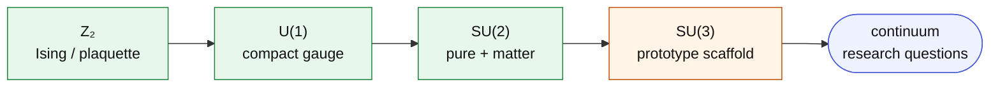

| ID | Benchmark | Status and scope |
|---|---|---|
| `gaugegap-0001` | Z₂ dual-chain / Ising sanity | exact finite baseline |
| `gaugegap-0002` | Z₂ plaquette chain | Pauli-compatible finite model |
| `gaugegap-u1-0001` | compact U(1) | truncated link Hilbert spaces |
| `gaugegap-0003` | SU(2) pure gauge | finite non-abelian benchmark |
| `gaugegap-0004` | SU(2) gauge-matter / hardware readiness | local checks before optional provider submission |
| `gaugegap-0005` | SU(3) scaffold | explicit `prototype_scaffold` status |
| `gaugegap-search-0001` | finite gap-candidate search | ranks size survival, perturbation stability, replicas, residuals |

<p align="center">
  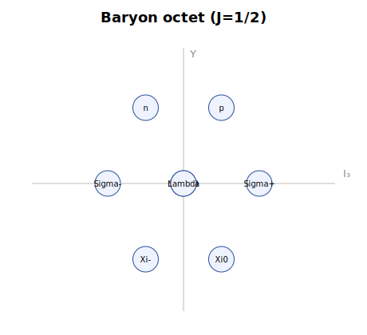
  &nbsp;&nbsp;
  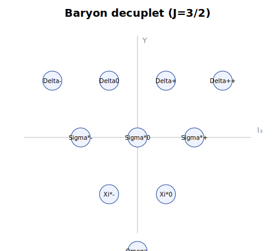
</p>

> 🧭 **Boundary:** all GaugeGap results are finite-lattice or finite-Hilbert-space benchmarks. There is no continuum Yang–Mills mass-gap claim.

---

## 🌊 FlowGap Track — finite PDE and nonlinear systems

| ID | System | Evidence bundle |
|---|---|---|
| `flowgap-0001` | viscous Burgers surrogate | finite differences, residuals, stability and convergence observables |
| `flowgap-0002-rossler` | Rössler flow | attractor diagnostics + regional contraction certificate |
| `flowgap-0003-lorenz` | Lorenz flow | attractor diagnostics + global volume-contraction certificate |
| `flowgap-0004-thomas` | Thomas cyclic flow | attractor diagnostics + global volume-contraction certificate |

> 🧭 **Boundary:** finite discretizations and finite-time integrations—not Navier–Stokes regularity, global chaos, or continuum existence proofs.

---

## 📈 CurveRank Track — Riemann-adjacent spectral screening

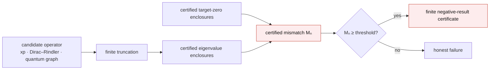

The current artifact rigorously rules out specified **finite truncations** under the displayed mismatch criterion. It does not prove or disprove the Riemann Hypothesis.

- 📘 [`docs/curverank-formal-proof.md`](docs/curverank-formal-proof.md)
- 📚 [`docs/riemann-operator-landscape.md`](docs/riemann-operator-landscape.md)
- 🖥️ [`docs/curverank-ibm-runbook.md`](docs/curverank-ibm-runbook.md)

---

## 🧩 Honest-by-construction DSLs

| DSL | First-class semantic | Claim form | Backed by | Fails when |
|---|---|---|---|---|
| **Spectra** | certification | `assert separated(...)` | interval evidence + certificate | separation cannot be certified |
| **Verdict** | evidence | `assert score(...) >= threshold` | logged reproducible evaluation | the evaluation misses its bar |

```bash
python scripts/run_spectra.py examples/curverank_screen.spectra
python scripts/run_verdict.py examples/sentiment_f1.verdict
```

---

## 🏗️ One Foundry workflow

Every supported invocation surface converges on `config/foundry.yaml`, sorted fragments in `config/foundry.d/`, and the `foundry` CLI. Make, CI, and Docker delegate to those IDs rather than maintaining their own scientific parameters.

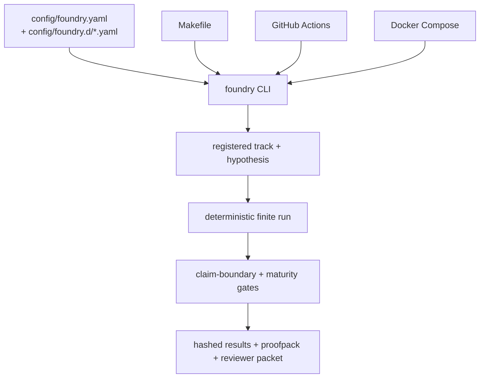

The fragment loader is deterministic and fails closed if two files declare the same unit or group ID.

📐 [`docs/ARCHITECTURE.md`](docs/ARCHITECTURE.md)

---

## 🚀 Run the Foundry

### Install

```bash
python3 -m venv .venv
source .venv/bin/activate
pip install -e '.[dev]'
```

### Discover and run registered experiments

```bash
foundry list
foundry run foundry-experience-v2
foundry run lagrangian-forge
foundry run foundry-experience
foundry run deep-boil-smoke
foundry run gaugegap-0002
foundry run flowgap-0001
foundry run flowgap-0002-rossler
foundry run curverank-0001
foundry audit
foundry proofpack
```

### One-command workflows

```bash
make smoke
make audit
make experience
make deep-boil
make attractor-forge
make proofpack
make reviewer-packet
```

### CurveRank reproduction and quantum lanes

```bash
make curverank-formal
make curverank-ibm
make curverank-hardware
make curverank
```

Provider hardware remains optional and credential-gated. No command submits to external quantum hardware by default.

### Docker

```bash
docker compose up
docker compose --profile gaugegap up gaugegap-track
docker compose --profile flowgap up flowgap-track
docker compose --profile curverank up curverank-track
```

---

## 🧭 Verification ladder

Claims climb only after the rung below holds:

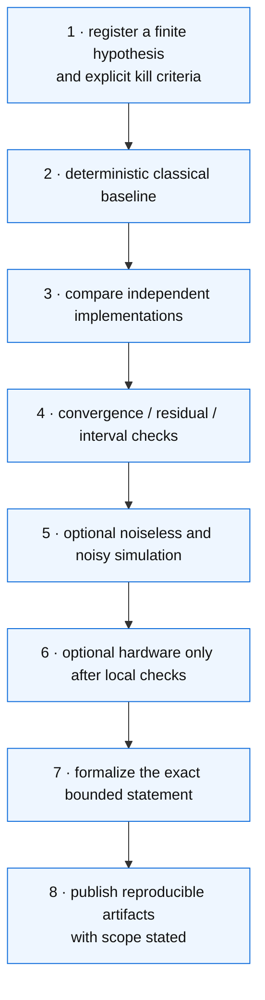

Backend order:

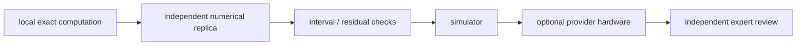

---

## 📂 Repository layout

```text
config/         canonical Foundry units and modular fragments
docs/           architecture, methods, boundaries, and runbooks
hypotheses/     registered finite-system hypotheses
scripts/        reproducible experiment and interface entry points
src/gaugegap/   scientific modules, DSLs, rigorous kernels, providers
site/           generated dependency-free Foundry Experience bundle
tests/          unit, regression, numerical, and smoke coverage
figures/        experience previews, attractors, weight diagrams, galleries
results/        small checked-in finite baseline artifacts
examples/       Spectra and Verdict programs
```

---

## 🧱 Claim boundary

Good language:

> finite-system benchmark · finite-time numerical evidence · local screening artifact · bounded formal statement · candidate negative result requiring independent review · prototype scaffold · canonical symbolic catalog · tree-level algebraic relation

Language this project does not earn:

> continuum Yang–Mills mass-gap proof · nonperturbative Standard Model construction · proof of the Riemann Hypothesis · formal proof of a global strange attractor from a plot · hardware result as mathematical proof · Millennium Prize resolution

The project becomes more credible by making the evidence **more explorable without making the claims larger**: the experience invites investigation, while the equations, manifests, tests, hashes, audits, and certificates show exactly what every scene does—and does not—establish.

---

## 📚 Documentation index

- [`docs/ARCHITECTURE.md`](docs/ARCHITECTURE.md) — unified Foundry architecture
- [`docs/foundry-experience.md`](docs/foundry-experience.md) — eight-scene audiovisual interface, scientific substrate, and boundaries
- [`docs/lagrangian-forge.md`](docs/lagrangian-forge.md) — Standard Model catalog, graph, controls, and audits
- [`docs/end-of-day-integration-2026-06-26.md`](docs/end-of-day-integration-2026-06-26.md) — complete integration inventory
- [`docs/deep-boil-verification.md`](docs/deep-boil-verification.md) — cross-track verification checkpoint
- [`docs/attractor-forge.md`](docs/attractor-forge.md) — nonlinear-dynamics evidence ladder
- [`docs/physical-limits-web.md`](docs/physical-limits-web.md) — physical-limits synthesis
- [`docs/inference-traps.md`](docs/inference-traps.md) — exact decision-theory demonstrations
- [`docs/epistemics-and-claim-boundaries.md`](docs/epistemics-and-claim-boundaries.md) — why boundaries matter
- [`docs/solution-gap-audit.md`](docs/solution-gap-audit.md) — honest gaps to stronger claims
- [`docs/agent-work-orders.md`](docs/agent-work-orders.md) — execution-ready hardening work
- [`docs/curverank-formal-proof.md`](docs/curverank-formal-proof.md) — finite spectral separation theorem
- [`docs/spectra-language.md`](docs/spectra-language.md) and [`docs/verdict-language.md`](docs/verdict-language.md)

## License

Apache-2.0.
