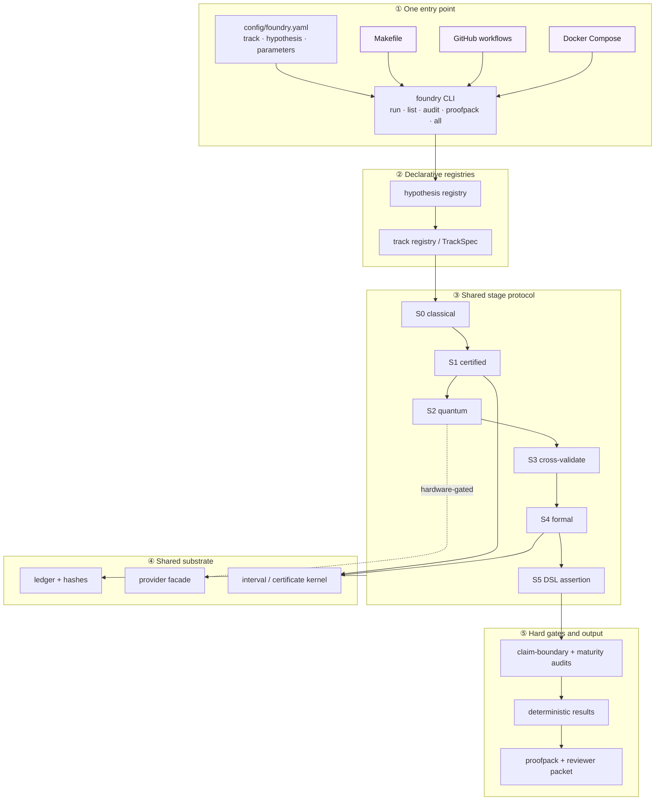

# 🔬 GaugeGap Foundry

> **Verification-first AI-for-science infrastructure for Millennium Prize-adjacent finite-system benchmarks.**


## Current status

> ⚠️ This repository is **not** claiming a solution to any Millennium Prize problem. It builds reproducible finite-system benchmarks, retains negative results, and creates verification infrastructure for theorem-adjacent progress.

The current CurveRank work includes a **computer-assisted spectral screening
result** for Berry–Keating-style operator candidates. Treat this as a local,
reproducible negative-result artifact that still needs independent expert review
before any publication claim.

Every GaugeGap item is **finite-system only**. There is no continuum Yang–Mills
mass-gap claim and no proof of the Riemann Hypothesis. Hardware results are noisy
experimental artifacts and do not constitute mathematical proof.

## One Foundry workflow

All supported invocation surfaces now converge on `config/foundry.yaml` and the
`foundry` CLI. Make, CI, and Docker remain convenient wrappers, but they do not
own independent parameter sets.

<details open>
<summary><strong>Master architecture</strong></summary>



</details>

The complete layer narrative, track-specific diagrams, inventory, and phased
migration plan live in **[`docs/ARCHITECTURE.md`](docs/ARCHITECTURE.md)**.

## Tracks

| Track | Finite scope | Main boundary |
|---|---|---|
| **GaugeGap** | Z₂ → U(1) → SU(2) → bounded SU(3) scaffold | no continuum mass-gap claim |
| **FlowGap** | deterministic finite PDE and nonlinear-system benchmarks | no Navier–Stokes regularity claim |
| **CurveRank** | certified screening of specified finite operator truncations | no RH or Hilbert–Pólya proof |
| **Physical limits** | established bounds reduced to exactly computable finite cores | no exotic-device or free-energy claim |
| **Spectra DSL** | assertions backed by certified interval evidence | certification fails closed |
| **Verdict DSL** | assertions backed by logged reproducible evaluations | model claims fail closed |

## One entry point

```bash
python3 -m venv .venv
source .venv/bin/activate
pip install -e '.[dev]'

foundry list
foundry run curverank-0001
foundry run gaugegap-0002
foundry run flowgap-0001
foundry audit
foundry proofpack
```

`foundry list` includes configured units and surfaces any remaining unregistered
`scripts/run_*.py` files as `script:<name>` with status `unclassified`. That is
intentional: orchestration debt stays visible until a script receives a reviewed
track, hypothesis, parameter set, output contract, and claim boundary.

Existing commands remain available:

```bash
make smoke
make audit
make unified
make proofpack
make reviewer-packet

docker compose up
docker compose --profile gaugegap up gaugegap-track
docker compose --profile flowgap up flowgap-track
docker compose --profile curverank up curverank-track
```

These wrappers delegate to `foundry`; their parameters are no longer separate
sources of truth.

## Verification path

The intended end-to-end contract is:

```text
classical finite baseline
→ certified enclosure or bounded statement
→ optional quantum method
→ independent cross-validation
→ formal export / machine recheck
→ Spectra or Verdict assertion
→ hard audits
→ deterministic results
→ proofpack and reviewer packet
```

The repository reuses:

- `src/gaugegap/ledger.py` for run IDs, git state, hashes, and JSONL;
- `src/gaugegap/rigorous/interval_arithmetic.py` for verified Hermitian eigenvalues;
- generic enclosure, bracket, and SMT certificate emitters;
- optional, credential-gated providers for IBM, Quantinuum, Braket, IonQ, and CUDA-Q;
- context-aware claim-boundary and research-maturity audits.

## Reproduce the finite CurveRank artifact

```bash
pip install -e '.[spectral]'
foundry run curverank-proof-reproduction
```

This reproduces a finite-truncation negative-result screen. It does not prove the
Riemann Hypothesis.

## Documentation

- [`docs/ARCHITECTURE.md`](docs/ARCHITECTURE.md) — master system architecture and migration spec
- [`docs/solution-gap-audit.md`](docs/solution-gap-audit.md) — honest gap to stronger scientific claims
- [`docs/agent-work-orders.md`](docs/agent-work-orders.md) — execution-ready hardening tasks
- [`docs/physical-limits-web.md`](docs/physical-limits-web.md) — certified physical-limits synthesis
- [`docs/epistemics-and-claim-boundaries.md`](docs/epistemics-and-claim-boundaries.md) — why the project draws its boundaries
- [`docs/curverank-formal-proof.md`](docs/curverank-formal-proof.md) — finite spectral separation statement and trust inputs
- [`docs/spectra-language.md`](docs/spectra-language.md) and [`docs/verdict-language.md`](docs/verdict-language.md)

## License

Apache-2.0.
