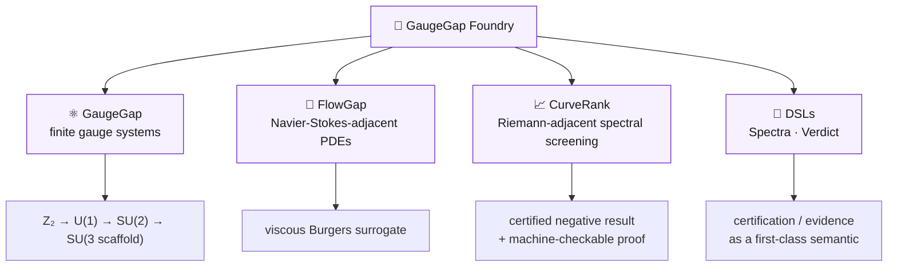
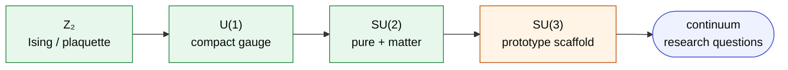
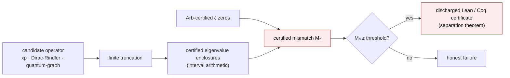
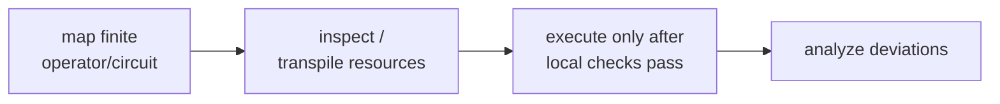
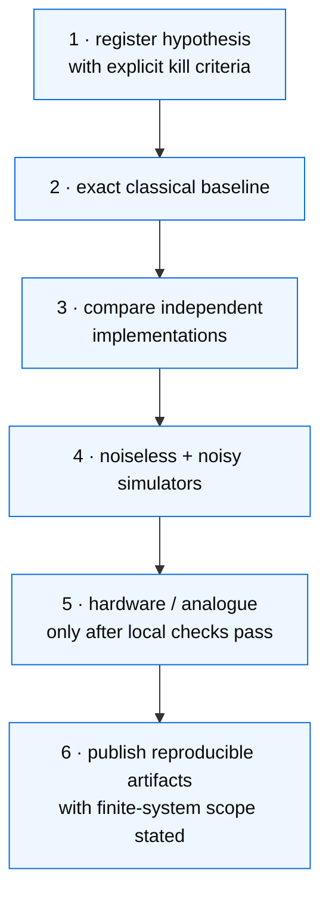
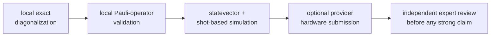

# 🔬 GaugeGap Foundry

> **Verification-first AI-for-science infrastructure for Millennium Prize-adjacent finite-system benchmarks.**


---

## 🎯 Current Status

> ⚠️ This repository is **not** claiming a solution to any Millennium Prize problem. It builds reproducible finite-system benchmarks, retains negative results, and creates verification infrastructure for theorem-adjacent progress.

The current CurveRank work includes a **computer-assisted spectral screening result** for Berry-Keating-style operator candidates. Treat this as a local, reproducible negative-result artifact that still needs independent expert review before any publication claim.

- 📄 Example certificate: `results/sprint-now/proof_certificate.json`
- 📊 Example summary: `results/sprint-now/PROOF_SUMMARY.md`

### 🛡️ Hardening status

The repo tracks a practical solution-gap scorecard and agent work orders:

| Artifact | Purpose |
|---|---|
| 📋 `docs/solution-gap-audit.md` | honest gap between current finite benchmarks and a true solution path |
| 🤖 `docs/agent-work-orders.md` | execution-ready tasks for Codex/agent runs |
| 🔎 `scripts/research_maturity_audit.py` | scans for unbounded placeholder/prototype risk |
| 🛠️ `Makefile` | one-command smoke, audit, proofpack, and reviewer-packet targets |

---

## 🗺️ The Foundry at a glance



> 🧭 **Boundary:** every track is **finite-system only**. No continuum Yang-Mills mass-gap claim, and no proof of the Riemann Hypothesis.

---

## 🌐 The web of physical limits — gallery

A set of finite-system modules, each built by stripping a viral "physics" reel down to
the one genuine, exactly computable statement it contains, and certifying it with a
discharged Lean 4 / Coq inequality (independently re-checked by z3). They turn out to be
**one structure**: trade-offs among four currencies — **energy, time, information, geometry**.

<p align="center">
  
</p>

| Member | Currencies | Certified inequality |
|---|---|---|
| Quantum speed limit | time ↔ energy | `t ≥ τ_QSL` |
| Temporal double slit | time ↔ frequency | `Δω = 2π/Δt`, `σ_t σ_ω ≥ ½` |
| Sonification / sampling | time ↔ frequency | aliasing fold `0 < f_s − f < f_s/2` |
| Ergotropy / passivity | work ↔ entropy | `0 ≤ W ≤ ⟨H⟩ − E₀` (no free energy) |
| Decoherence / branching | information | `1 ≤ N_eff ≤ d` |
| Landauer's principle | info ↔ energy | `W ≥ k_B T ln 2` |
| Bekenstein bound | info ↔ energy ↔ geometry | `S ≤ 2π R E` |
| Alcubierre energy cond. | energy ↔ geometry | `ρ ≤ 0` (needs negative energy) |
| Cherenkov cone | velocity ↔ geometry | `cos θc = 1/(nβ)`, `β > 1/n` |
| Lieb–Robinson cone | information ↔ time | `x(t) ≤ v_LR·t + ξ` |

📖 Full synthesis: [`docs/physical-limits-web.md`](docs/physical-limits-web.md) · 🖼️ gallery + certificate ladder: [`figures/physical-limits/`](figures/physical-limits/) (open `index.html`) · ▶️ reproduce: `make physical-limits` · `make physical-limits-figures` · `make verify-certificates`

> 🧭 **Boundary:** finite-system / semiclassical demonstrations of *established* bounds, each bracketed or machine-checked — not continuum/Millennium claims, not a buildable warp drive or free-energy device.

---

## ⚛️ GaugeGap Track — finite gauge-system benchmarks

**Natural progression:**



| ID | Benchmark | Notes |
|---|---|---|
| `gaugegap-0001` | 🟢 Z₂ dual-chain / Ising sanity | finite transverse-field Ising chain; validates hypothesis registry + exact diagonalization |
| `gaugegap-0002` | 🟢 Z₂ plaquette chain | `H = -J Σ_p Π_{l∈p} Z_l - h Σ_l X_l`; Pauli/Qiskit-compatible export |
| `gaugegap-u1-0001` | 🟢 U(1) compact gauge | finite-lattice U(1) in 2+1D; truncated link Hilbert spaces |
| `gaugegap-0003` | 🟢 SU(2) pure gauge | first non-abelian finite benchmark in the series |
| `gaugegap-0004` | 🟢 SU(2) gauge-matter / hardware-readiness | string-breaking + meson spectrum; finite Z₂ hardware-readiness validator before any provider submission |
| `gaugegap-0005` | 🟧 SU(3) prototype scaffold | records `implementation_status=prototype_scaffold`; plaquette group multiplication, Gauss-law, Wilson loops, physical-subspace projection remain work-order items |
| `gaugegap-search-0001` | 🟢 Z₂ finite gap candidate search | ranks candidates by gap size, finite-size survival, perturbation stability, replica agreement, residuals |

> 🧭 **Boundary:** all GaugeGap items are finite-system benchmarks only; **no continuum Yang-Mills mass-gap claim.**

The SU(3) scaffold targets the standard `su(3)` weight structure (octet & decuplet), used here only as finite-system bookkeeping:

<p align="center">
  
  &nbsp;&nbsp;
  
</p>

---

## 🌊 FlowGap Track — Navier-Stokes-adjacent finite PDE systems

- **`flowgap-0001`**: viscous Burgers equation surrogate — a Navier-Stokes-adjacent proxy with pressure-Poisson subroutine benchmarks.

---

## 📈 CurveRank Track — Riemann-adjacent spectral screening

- **`curverank-0001`**: candidate operator screening against zeta-zero-inspired targets — a Berry-Keating-style **negative-result** artifact; the quantum phase-estimation path is exploratory.



What this **does**: rigorously rules out a *specific finite-truncation operator* as a Hilbert–Pólya candidate (`Mₙ ≳ 27` for the `xp` panel, certified). What it does **not** do: it is **not a proof** of the Riemann Hypothesis, and makes no continuum claim. See:

- 📘 `docs/curverank-formal-proof.md` — the machine-checkable separation theorem (exported to Lean 4 / Coq / Isabelle, with discharged Lean `linarith` / Coq `lra` proofs for all three families).
- 📚 `docs/riemann-operator-landscape.md` — a cited survey of operator / quantum routes to RH and why none is a near-term proof.
- 🖥️ `docs/curverank-ibm-runbook.md` — windowed QPE on the IBM/Aer emulator (and how to stage a real-hardware run).

⚡ The certified screening kernel is **~14× faster** as of the latest revision (matrix→interval conversion reused across eigenpairs), with **bit-identical** results.

---

## 🧩 Honest-by-construction DSLs

Two tiny languages bake this repo's integrity rule into their semantics — a program that runs only states what it can back.

| DSL | First-class semantic | A claim is… | …backed by | Fails when |
|---|---|---|---|---|
| 🧮 **Spectra** (`docs/spectra-language.md`) | certification | `assert separated(M, …)` | a discharged Lean/Coq certificate | the interval kernel can't certify it |
| 🧪 **Verdict** (`docs/verdict-language.md`) | evidence | `assert score(E) >= t` | a logged, reproducible eval run | the eval doesn't meet the bar |

```bash
python scripts/run_spectra.py examples/curverank_screen.spectra   # certified spectral screening
python scripts/run_verdict.py examples/sentiment_eval.verdict      # eval-first model claims
```

> 🧭 **Boundary:** Spectra screens finite truncations (certified negative result, **not** a proof of RH); Verdict uses deterministic toy models to demonstrate eval-first semantics, **not** a production eval framework.

---

## ⚙️ Qiskit 2.4 / IBM Runtime findings applied

The hardware-readiness lane follows IBM's current Qiskit pattern:



The Qiskit 2.4 release strengthens Pauli-centric workflows, faster QPY serialization, transpilation infrastructure, and compiled-extension paths. For this repo that means:

- 🧱 keep Pauli terms as first-class artifacts;
- 📐 record resource estimates before any backend call;
- ✅ avoid hardware submission until exact and Pauli dense replicas agree;
- 🔐 serialize and hash validation outputs as proofpack material;
- 🔌 keep Qiskit/IBM Runtime optional — finite exact baselines must run without provider credentials.

The first implementation is `gaugegap-0004`, a local hardware-readiness validator for finite Z₂ candidates. It does not submit to hardware by default.

> ⚠️ Hardware results are noisy experimental artifacts and do not constitute mathematical proof.

---

## 🚀 Quick Start

### Reproduce the local spectral screening artifact

```bash
python3 -m venv .venv
source .venv/bin/activate
pip install -e ".[spectral]"

python scripts/run_curverank_screen.py \
    --family xp \
    --n-basis 10,15,20 \
    --k-zeros 20 \
    --output-dir results/verify

cat results/verify/curverank-0001-spectral-screen.csv
```

### Run core benchmarks

```bash
pip install -e '.[all]'

# ⚛️ GaugeGap
python scripts/run_gap_sweep.py
python scripts/run_z2_plaquette.py
python scripts/run_z2_plaquette_sweep.py
python scripts/run_gaugegap_u1.py
python scripts/run_gaugegap_su2_pure.py
python scripts/run_gaugegap_su3_pure.py
python scripts/search_gap_candidates.py --output-dir /tmp/gaugegap-search-0001 --max-candidates 10
python scripts/run_candidate_validation.py --output-dir /tmp/gaugegap-0004 --disable-qiskit-probe
python scripts/run_qiskit_candidate_validation.py --output-dir /tmp/gaugegap-qiskit-validation
python scripts/submit_ibm_runtime_candidate.py --dry-run --output-dir /tmp/gaugegap-runtime-dryrun

# 🌊 FlowGap
python scripts/run_flowgap_burgers.py

# 📈 CurveRank
python scripts/run_curverank_screen.py --family xp --n-basis 10,15,20,25,30

# ✅ Tests
python -m pytest
```

### One-command reviewer workflow

```bash
make audit            # claim-boundary (strict) + maturity audit
make smoke            # fast end-to-end checks
make proofpack        # hashed, reproducible proof bundle
make reviewer-packet  # self-contained packet for outside experts
```

### CurveRank reproduction (formal proof + IBM + hardware report)

```bash
make curverank-formal     # Lean/Coq/Isabelle certificates + discharged proofs
make curverank-ibm        # windowed QPE on the local IBM/Aer emulator (no creds)
make curverank-hardware   # dense vs Trotter vs iterative circuit-cost report
make curverank            # all three
```

### Claim-boundary audit and proofpack

```bash
python scripts/claim_boundary_audit.py --strict
python scripts/research_maturity_audit.py --strict
python scripts/generate_reproducibility_proofpack.py \
  --output-dir results/proofpack \
  --include-search \
  --include-validation
```

The proofpack writes a JSON manifest, a Markdown summary, command logs, output hashes, and the claim boundary used for the run. The maturity audit flags unbounded placeholder/prototype risk before public claims are made.

### Run SU(3) prototype scaffold

```bash
python scripts/run_gaugegap_su3_pure.py \
    --lattice-sizes 2x2 \
    --g-coupling-min 0.5 \
    --g-coupling-max 2.0 \
    --g-coupling-points 5 \
    --truncation 0.5 \
    --output-dir results/baselines

cat results/baselines/gaugegap-0005-su3-prototype-sweep.csv
```

Optional hardware submission commands require provider credentials and should be treated as exploratory finite-system runs, not proof artifacts. See also `docs/gaugegap-0004-hardware-readiness.md`, `docs/qiskit-2-4-validation.md`, `docs/ibm-runtime-submission.md`.

### 🐳 Docker deployment

```bash
docker-compose up
docker-compose --profile gaugegap up
docker-compose --profile flowgap up
docker-compose --profile curverank up
```

See `DEPLOYMENT.md` for the deployment guide.

---

## 🧭 Program Direction

The foundry is designed around a **verification ladder** — claims only climb after the rung below holds:



**Backend order:**



---

## 📂 Repository Layout

```text
docs/           roadmap and methods notes
hypotheses/     registered finite-system hypotheses
scripts/        reproducible experiment entrypoints
src/gaugegap/   package code (incl. spectra_lang, verdict_lang, rigorous/, relativity/)
examples/       Spectra (.spectra) and Verdict (.verdict) programs
figures/        weight diagrams, static figures, physical-limits web gallery
tests/          unit tests and smoke coverage (492)
results/        small checked-in baseline artifacts
```

---

## 🧱 Claim Boundary

✅ Use language like:

> finite-system benchmark · local screening artifact · candidate negative result requiring independent review · prototype scaffold

🚫 Avoid unbounded claim language such as:

> continuum Yang-Mills mass-gap proof · Millennium Prize resolution · theorem ready for a prize claim

That boundary is intentional. **The project earns credibility by making every small claim reproducible before expanding scope.** 🔁
