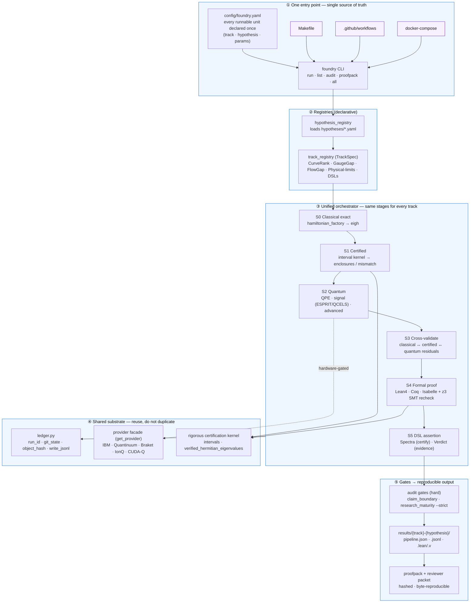
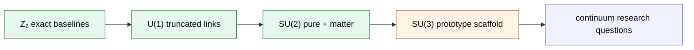
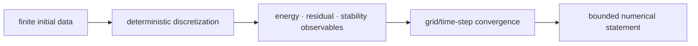
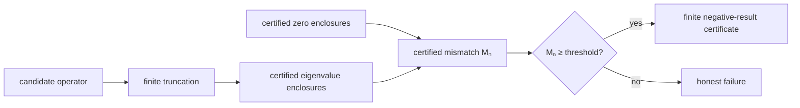
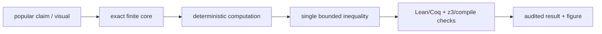
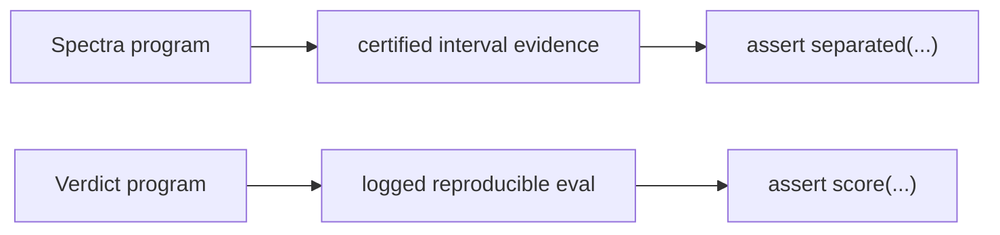

# GaugeGap Foundry — Unified Architecture

> **Claim boundary:** GaugeGap Foundry is verification-first infrastructure for
> reproducible **finite-system** benchmarks. It does not claim a continuum
> Yang–Mills mass-gap proof, a proof of the Riemann Hypothesis, or a solution to
> any Millennium Prize problem. Numerical evidence, prototype scaffolds, hardware
> experiments, and machine-checked statements remain explicitly distinguished.

This document is the architecture source of truth. The repository's invocation
surfaces must converge on the workflow below rather than re-encoding scientific
parameters independently.

## The one workflow

### ① Entry point

`config/foundry.yaml` owns runnable IDs and their canonical parameters.
`foundry` resolves those IDs and executes them from the repository root.
Make, CI, and Docker are compatibility surfaces only; they must delegate instead
of embedding another parameter set.

Phase 1 includes discovery of unregistered `scripts/run_*.py` files. They appear
as `script:<name>` with status `unclassified`, which makes orchestration debt
visible without pretending each legacy script already has a reviewed TrackSpec.

### ② Registries

Phase 2 replaces hard-coded hypothesis strings with validated YAML loading and a
track-agnostic `TrackSpec`. A registered track supplies its supported stages,
claim boundary, parameter schema, output contract, and optional hardware path.

### ③ Orchestrator stages

Every track uses the same stage vocabulary, while unsupported stages are recorded
as `not_applicable` or bounded `prototype_scaffold` rather than silently skipped.

| Stage | Contract |
|---|---|
| S0 classical | Exact or deterministic finite baseline and provenance |
| S1 certified | Interval enclosure, bracket, mismatch, or exact bounded statement |
| S2 quantum | Optional simulator/hardware method; never proof by itself |
| S3 cross-validation | Residuals and agreement tests between independent methods |
| S4 formal | Lean/Coq/Isabelle export plus z3/compiled checks where supported |
| S5 DSL | Spectra for certified assertions; Verdict for evidence-backed assertions |

### ④ Shared substrate

The ledger, rigorous interval kernel, generic certificate emitters, and provider
adapters are infrastructure, not track-specific copies. Phase 3 collapses the
remaining Hamiltonian, IBM, and spectrum-certification duplication onto these
seams.

### ⑤ Gates and output

The claim-boundary and maturity audits are hard gates. Successful orchestration
writes deterministic, hashed artifacts and only then builds proofpacks and
reviewer packets. Fixed `SOURCE_DATE_EPOCH` remains the reproducibility clock.

## Track views

These diagrams explain track-specific science. They do not define separate
execution systems.

### GaugeGap — finite gauge systems

Boundary: finite lattices and finite Hilbert-space truncations only. SU(3)
plaquette multiplication, Gauss-law enforcement, and Wilson-loop completion
remain bounded work items until their known-answer tests pass.

### FlowGap — finite nonlinear and PDE systems

Boundary: finite discretizations and surrogate equations; no Navier–Stokes
regularity claim.

### CurveRank — finite spectral screening

Boundary: rules out specified finite truncations only; not a Hilbert–Pólya or
Riemann-Hypothesis proof.

### Physical-limits web

Boundary: finite-system or semiclassical demonstrations of established bounds,
not buildable exotic devices and not continuum/Millennium claims.

### Integrity DSLs

Spectra refuses certification when the interval kernel cannot establish the
assertion. Verdict refuses a model claim when the recorded evaluation misses its
threshold.

## Initial module inventory

This is the initial architecture classification used to drive Phases 2–4.
Anything not explicitly classified is **unclassified**, not silently
“production.” `foundry list` also surfaces every unregistered `run_*` script.

| Area / module family | Current status | Phase action |
|---|---|---|
| `ledger.py` | production shared substrate | retain as the provenance API |
| `rigorous/interval_arithmetic.py` | production shared substrate | canonical eigenvalue kernel |
| `rigorous/{enclosure,bracket,smt}_certificate.py` | production shared substrate | reuse from all tracks |
| `certify.py` | production, canonical candidate | make the only public spectrum-certification API |
| `curverank_registry.py` | production, track-specific | generalize into `TrackSpec` |
| `scripts/run_unified_pipeline.py` | production, CurveRank-only | lift stages into orchestrator |
| claim-boundary / maturity audits | production hard gates | invoke through `foundry audit` |
| proofpack / reviewer packet | production output layer | invoke through `foundry proofpack` |
| Z₂ / U(1) / SU(2) Hamiltonians | production finite models | register with one factory |
| SU(3) pure / link path | prototype scaffold | retain explicit prototype boundary |
| `quantum/open_system.py` | production-quality, under-orchestrated | wire into S2-advanced |
| `quantum/adiabatic_quantum.py` | production-quality, under-orchestrated | wire and cross-validate |
| `quantum/ergotropy.py` | active physical-limits member | reuse; do not duplicate |
| `quantum/optimal_control.py` | production-quality, under-orchestrated | add registered demo + tests |
| `quantum/advanced_qpe.py` | production-quality, under-orchestrated | route through provider facade |
| `quantum/quantum_metrology.py` | production-quality, partly wired | standardize S2 output contract |
| `quantum/advanced_hamiltonian_simulation.py` | production-quality, partly wired | standardize S2 output contract |
| `quantum/shadow_tomography.py` | deprecated candidate | retire in favour of certified shadows |
| measurement mitigation hardware loop | incomplete, bounded | keep hardware-gated until validated |
| QNG/QGT inversion | incomplete, bounded | preserve `not_implemented` marker |
| gauge-invariant ansätze | incomplete, bounded | preserve prototype marker |
| remaining unlisted modules | unclassified | inventory before activation or retirement |

## Phase map

| Phase | Deliverable | Acceptance gate |
|---|---|---|
| 0 | this architecture source of truth | docs review; no scientific behavior change |
| 1 | config + `foundry` CLI + delegated surfaces | list/run/audit/proofpack/all resolve from one config |
| 2 | hypothesis/track registries + orchestrator | identical CurveRank artifact through new path |
| 3 | Hamiltonian/provider/certification consolidation | bit-for-bit legacy regression tests |
| 4 | activate or retire orphaned quantum modules | every activated unit has tests and a claim boundary |
| 5 | work-order closure | full proofpack/reviewer packet reproducibility in CI |

## Non-negotiable engineering rules

1. Finite means finite; numerical means numerical; prototype means prototype.
2. Hardware execution is opt-in and credential-gated. Base installation remains
   usable without Qiskit or provider credentials.
3. Exact enclosure membership is distinct from tolerance-based near-miss status.
4. No orchestration layer may weaken the two audit gates.
5. A compatibility wrapper may delegate, but it may not own a second parameter set.
