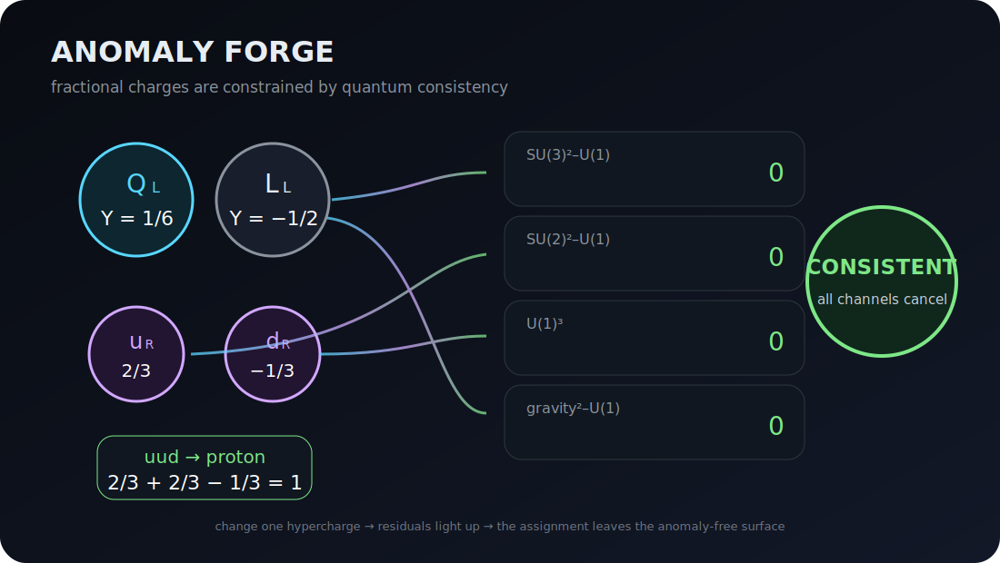

# Anomaly Forge

Anomaly Forge turns Standard Model charge assignments into an exact, manipulable consistency test.



## Run the exact audit

```bash
foundry run anomaly-forge
```

Artifacts are written to:

```text
results/anomaly-forge/anomaly_report.json
results/anomaly-forge/anomaly_balance.svg
```

A custom rational assignment can be checked directly:

```bash
python scripts/run_anomaly_forge.py \
  --y-q 1/6 --y-u 7/10 --y-d=-1/3 \
  --y-l=-1/2 --y-e=-1 --require-pass
```

The command exits nonzero when `--require-pass` is supplied and the assignment is inconsistent.

## Open the interactive scene

```bash
foundry run anomaly-forge-experience
```

Open `site/foundry-experience/index.html`, choose **Anomaly Forge**, then use the existing projection selector:

| Projection | View |
|---|---|
| `xy` | anomaly-balance ring with exact-cancellation status |
| `xz` | four triangle-anomaly channels |
| `yz` | up/down quark and proton/neutron charges |
| `3d` | live position relative to the anomaly-free surface |

The sliders expose `N_c`, number of generations, and the five minimal hypercharges. Green means every registered local coefficient vanishes and the global `SU(2)` doublet count is even. Red means at least one consistency condition has failed.

## Registered checks

With `Q = T3 + Y`, right-handed fields enter anomaly sums through their left-handed conjugates:

```text
SU(3)^2-U(1)   = N_g (2Y_Q - Y_u - Y_d)
SU(2)^2-U(1)   = N_g (N_c Y_Q + Y_L)
U(1)^3         = N_g (2N_cY_Q^3 - N_cY_u^3 - N_cY_d^3 + 2Y_L^3 - Y_e^3)
gravity^2-U(1) = N_g (2N_cY_Q - N_cY_u - N_cY_d + 2Y_L - Y_e)
```

The global `SU(2)` check requires an even number of left-handed weak doublets.

For the minimal Standard Model assignment:

```text
Y_Q = 1/6   Y_u = 2/3   Y_d = -1/3
Y_L = -1/2  Y_e = -1    Y_H = 1/2
```

all registered coefficients are exactly zero, the proton has charge `+1`, and the neutron has charge `0`.

## Solver assumptions

`gaugegap.hypercharge_solver.solve()` reports either:

- `unique_under_assumptions` for the minimal field inventory without a right-handed neutrino;
- `underdetermined_family` when a Dirac right-handed neutrino is included, exposing the remaining one-parameter family.

The assumptions are returned with every solution rather than hidden inside the solver.

## Claim boundary

Anomaly Forge proves exact cancellation only for the declared finite chiral field inventory, conventions, and assumptions. It does not show that the Standard Model is the only possible theory, construct the continuum quantum field theory, calculate loop amplitudes, or solve the Yang-Mills Millennium Prize problem.
