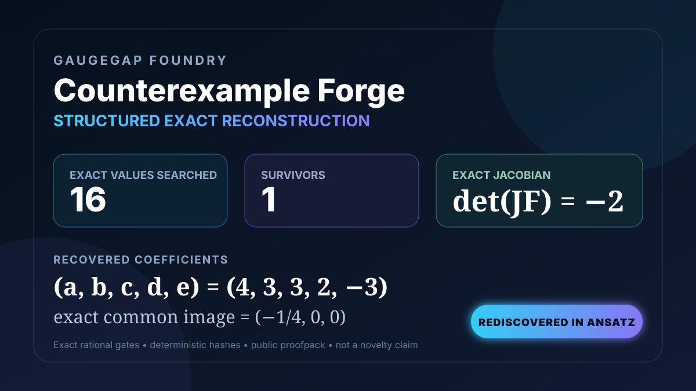

# Counterexample Forge 0001 — exact reconstruction result

<p align="center">
  
</p>

## Result

GaugeGap Foundry searched a declared exact one-parameter family derived from a sparse polynomial ansatz and the constant-Jacobian constraints.

```text
Search window: every nonzero integer e from -8 through 8
Exact candidates tested: 16
Fully verified survivors: 1
```

The surviving parameter is:

```text
e = -3
(a, b, c, d, e) = (4, 3, 3, 2, -3)
det(JF) = -2
common image = (-1/4, 0, 0)
```

The reconstruction input did not contain the final published coefficient tuple. It contained:

- the declared sparse ansatz;
- the exact reduction of the constant-Jacobian equations;
- the registered rational collision witnesses;
- the bounded integer search window.

The recovered candidate is then sent through the independent exact verifier. It must have a nonzero constant Jacobian, pairwise-distinct witnesses and one exact common image. Tampered witnesses and search windows excluding `e = -3` produce honest negative results.

## Evidence state

**REDISCOVERED within a declared ansatz.**

This is stronger than merely substituting a known formula and checking it, but weaker than blind search. It is not a new mathematical discovery, a minimality result or an autonomous resolution of an open problem.

## Reproduce

```bash
foundry run counterexample-forge-0001-verify
foundry run counterexample-forge-0001-reconstruct
```

The verification runner emits `gaugegap.counterexample_proofpack.v1`. The reconstruction runner emits `gaugegap.counterexample_reconstruction.v1`. Both use canonical exact-rational serialization and SHA-256 digests.

> **Claim boundary:** this page reports exact structured reconstruction of a previously public three-variable witness. It does not establish novelty, blind autonomous discovery or a result for any separately open lower-dimensional case.
