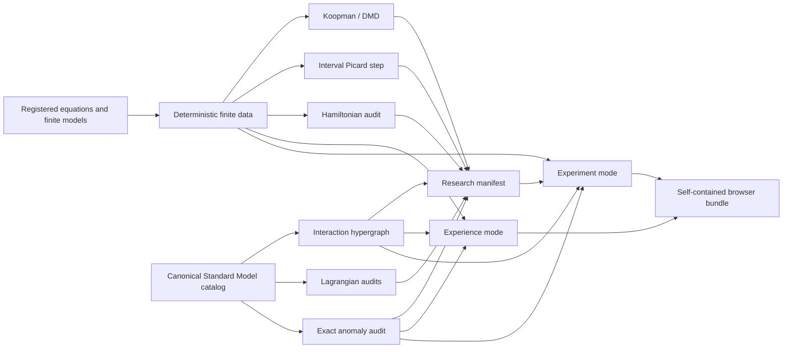

# GaugeGap Foundry Experience

GaugeGap Foundry has a browser-native audiovisual interface that separates two jobs which should not be confused:

- **Experience** turns finite scientific data into an immersive field of motion, sound, geometry, spectra, symbolic structure, and live numerical overlays.
- **Experiment** exposes the equations, parameters, projections, diagnostics, provenance, audits, and claim boundary behind each scene.

The conceptual split is inspired by Ryoji Ikeda's `supersymmetry [experience]` and `supersymmetry [experiment]`: one installation emphasizes sensory immersion, while the other exposes apparatus, measurement, and process. GaugeGap Foundry adopts that separation as an interface principle without copying Ikeda's artwork, sound, photography, or software.

Reference: <https://www.ryojiikeda.com/project/supersymmetry/>

## What is included

The complete generated interface contains nine scenes:

| Scene | Source | Interactive layer | Evidence layer |
|---|---|---|---|
| Rössler | registered ODE | parameter sliders, projection, client-side RK4, sonification | Lyapunov spectrum, DMD, Poincaré count, validated interval step |
| Lorenz | registered ODE | parameter sliders, projection, client-side RK4, sonification | Lyapunov spectrum, DMD, Poincaré count, validated interval step |
| Thomas | registered ODE | parameter slider, projection, client-side RK4, sonification | Lyapunov spectrum, DMD, Poincaré count, validated interval step |
| Gauge lattice | finite cubic lattice | rotation, density, line/point mode | finite geometry and Wilson-loop path boundary |
| SU(3) weights | exact finite representation data | octet/decuplet cycling and rotation | representation-theory boundary |
| Lagrangian Forge | canonical compact Standard Model catalog | interaction graph, equation wall, symmetry breaking, vertex atlas, coupling sliders | field/sector/vertex inventory, charge and dimension audits, electroweak mass-matrix checks |
| Anomaly Forge | exact rational chiral charge inventory | hypercharge sliders, anomaly-balance ring, triangle channels, fractional-charge cards, constraint surface | exact local coefficients, global SU(2) parity, solver assumptions, proton/neutron charges |
| Finite spectra | canonical Hamiltonian factory | visual comparison | Hermiticity audit, matrix digest, finite spectral gap |
| Mass-radius limits | dimensionless Planck-unit formulas | animated finite plot | explicit formula and scaling boundary |

The Lagrangian Forge scene does not use an artistic blackboard transcription as scientific source data. It reconstructs the visual density from the canonical compact Standard Model sector catalog in `src/gaugegap/standard_model_catalog.py`.

The Anomaly Forge scene uses exact rational arithmetic in `src/gaugegap/anomaly_audit.py`. The browser recomputes the same polynomial residuals for interactive exploration, while the standalone runner and unit tests remain the source of exact pass/fail evidence.

## Run it

Run the complete nine-scene interface:

```bash
foundry run foundry-experience-v2
# focused aliases
foundry run lagrangian-forge
foundry run anomaly-forge
foundry run anomaly-forge-experience
```

or directly:

```bash
python scripts/generate_foundry_experience_complete.py \
  --output-dir site/foundry-experience \
  --preview figures/foundry-experience/preview.svg
```

The original seven-scene generator remains available as a stable base implementation:

```bash
foundry run foundry-experience
```

Then open:

```text
site/foundry-experience/index.html
```

The page is dependency-free. It uses only HTML, CSS, Canvas, vanilla JavaScript, and optional WebAudio. No CDN or external JavaScript framework is required.

## Experience mode

Experience mode is intentionally sparse. It:

- cycles through the scientific scenes automatically;
- reveals trajectories progressively instead of drawing everything at once;
- rotates three-dimensional finite structures;
- animates the Standard Model interaction graph, equation wall, symmetry-breaking masses, and vertex atlas;
- displays charge-cancellation channels and fractional-charge structure in Anomaly Forge;
- maps the active state to two oscillators and a gain envelope after the visitor explicitly enables sound;
- keeps finite-claim status visible even while the control panels are hidden;
- displays the dataset schema, scene identifier, git commit, and boundary in the moving ticker.

The sound is generated from normalized data coordinates. It is not a claim that any physical system “has” the generated sound.

## Experiment mode

Experiment mode reveals the machinery:

- system and scene selection;
- `xy`, `xz`, `yz`, and rotating three-dimensional projections;
- editable ODE parameters and browser-side deterministic RK4 reintegration;
- Standard Model gauge, Higgs, Yukawa, vacuum-scale, and schematic gauge-parameter controls;
- exact-charge controls for colour count, generation count, and minimal hypercharges;
- interaction graph, equation-wall, symmetry-breaking, vertex-atlas, anomaly-balance, triangle-channel, fractional-charge, and constraint-surface views;
- density, speed, persistence, line, and point controls;
- equations and live finite diagnostics;
- embedded precomputed DMD and interval-validation records;
- Lagrangian structural audits, exact anomaly residuals, and tree-level observables;
- explicit claim boundaries for every scene.

Browser-side ODE runs are finite numerical experiments. They do not inherit the validated interval status of a precomputed canonical step unless the exact validated parameters match. Standard Model controls recompute finite tree-level algebraic relations; they do not evaluate the interacting quantum field theory. Browser anomaly controls are exploratory floating-point views; exact certification comes from the rational backend and tests.

## Scientific substrate

The complete interface is backed by six shared systems.

### 1. Canonical Hamiltonian factory

`src/gaugegap/hamiltonian_factory.py` provides one construction and audit surface for finite Z₂, truncated compact U(1), and explicitly labelled SU(2)/SU(3) prototypes. Every artifact reports normalized parameters, implementation maturity, finite claim boundary, matrix digest, Hermiticity residual, and exact finite spectrum and gap when available.

### 2. Koopman / DMD analysis

`src/gaugegap/koopman.py` implements finite-data exact DMD with SVD rank selection, discrete and continuous eigenvalues, phase-normalized modes, initial amplitudes, reconstruction residual, delay-coordinate embedding, and dominant-mode summaries.

The result is an approximation in the selected finite observable space. It is not a proof that the nonlinear flow has a finite-dimensional Koopman-invariant subspace.

### 3. Validated interval dynamics

`src/gaugegap/validated_dynamics.py` implements a Picard-inclusion step:

```text
X₀ + [0, Δt] f(B) ⊆ B
```

When the inclusion closes, the exact solution starting in the supplied initial interval box remains in `B` over the configured finite step. This does not establish a global strange attractor, chaos, ergodicity, long-time boundedness, or a continuum PDE theorem.

### 4. Standard Model catalog and Lagrangian audits

The complete scene is built from:

- `src/gaugegap/standard_model_catalog.py` — field, sector, interaction, coupling, gauge-convention, and tree-level observable catalog;
- `src/gaugegap/interaction_graph.py` — deterministic interaction hypergraph;
- `src/gaugegap/lagrangian_audit.py` — fail-closed structural checks;
- `src/gaugegap/lagrangian_scene.py` — Standard Model scene dataset and browser extension.

This is a finite symbolic and tree-level representation. It does not calculate scattering amplitudes, loops, renormalization, a path integral, or a nonperturbative continuum Standard Model.

### 5. Exact anomaly audit and hypercharge solver

The ninth scene is built from:

- `src/gaugegap/anomaly_audit.py` — exact `Fraction` arithmetic for `SU(3)^2-U(1)`, `SU(2)^2-U(1)`, `U(1)^3`, mixed gravitational hypercharge, and global SU(2) parity;
- `src/gaugegap/hypercharge_solver.py` — assumption-labelled minimal and right-neutrino solutions;
- `src/gaugegap/anomaly_scene.py` — deterministic scene data and self-contained browser extension;
- `scripts/run_anomaly_forge.py` — JSON/SVG evidence runner with fail-closed exit behavior.

The minimal assignment is unique only under the declared field content, Higgs normalization, generation universality, and Yukawa assumptions. Adding a Dirac right-handed neutrino exposes a one-parameter anomaly-free family.

### 6. Research claim manifests

`src/gaugegap/research_manifest.py` binds each research claim to an explicit claim level, finite scope, assumptions, exclusions, hashed evidence artifacts, methods, parameters, git commit, and external review when relevant.

The validator fails closed. A claim cannot be promoted to `formal_finite_theorem` without checked formal evidence, and a `continuum_theorem` requires machine-checked formal evidence, a peer-reviewed publication artifact, a continuum argument, and at least two external reviews.

## Deep Boil integration benchmark

Run all shared systems together:

```bash
foundry run deep-boil-smoke
foundry run deep-boil-0001
foundry run foundry-experience-v2
foundry run anomaly-forge
```

The full verification stack checks:

1. Rössler, Lorenz, and Thomas finite trajectories;
2. finite DMD residuals and dominant modes;
3. validated one-step interval enclosures;
4. canonical Z₂ and U(1) Hamiltonian construction;
5. Hermiticity and finite spectral gaps;
6. research-manifest generation;
7. canonical Standard Model catalog and interaction graph;
8. Lagrangian charge, dimension, reference, mixing, and source-boundary audits;
9. exact anomaly cancellation, a deliberate broken assignment, solver assumptions, and global SU(2) parity;
10. generation of the complete nine-scene Experience/Experiment site.

## Architecture



## Claim boundary

The interface is a scientific communication and exploration layer over finite computations. It does not convert visual complexity into proof. In particular:

- an attractor-like image is not a theorem about a global strange attractor;
- a positive finite-time Lyapunov estimate is not a formal proof of chaos;
- a finite lattice spectral gap is not the continuum Yang–Mills mass gap;
- a finite PDE surrogate is not Navier–Stokes existence and smoothness;
- the Standard Model catalog is not a nonperturbative continuum construction or path-integral evaluation;
- anomaly cancellation under a declared field inventory does not prove uniqueness across every possible theory;
- an interactive visualization is not independent scientific validation;
- no part of this interface claims a Millennium Prize solution.
