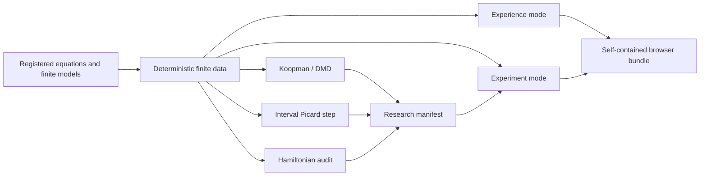

# GaugeGap Foundry Experience

GaugeGap Foundry now has a browser-native audiovisual interface that separates two jobs which should not be confused:

- **Experience** turns finite scientific data into an immersive field of motion, sound, geometry, spectra, and live numerical overlays.
- **Experiment** exposes the equations, parameters, projections, diagnostics, provenance, and claim boundary behind each scene.

The conceptual split is inspired by Ryoji Ikeda's `supersymmetry [experience]` and `supersymmetry [experiment]`: one installation emphasizes sensory immersion, while the other exposes apparatus, measurement, and process. GaugeGap Foundry adopts that separation as an interface principle without copying Ikeda's artwork, sound, photography, or software.

Reference: <https://www.ryojiikeda.com/project/supersymmetry/>

## What is included

The generated interface contains seven scenes:

| Scene | Source | Interactive layer | Evidence layer |
|---|---|---|---|
| Rössler | registered ODE | parameter sliders, projection, client-side RK4, sonification | Lyapunov spectrum, DMD, Poincaré count, validated interval step |
| Lorenz | registered ODE | parameter sliders, projection, client-side RK4, sonification | Lyapunov spectrum, DMD, Poincaré count, validated interval step |
| Thomas | registered ODE | parameter slider, projection, client-side RK4, sonification | Lyapunov spectrum, DMD, Poincaré count, validated interval step |
| Gauge lattice | finite cubic lattice | rotation, density, line/point mode | finite geometry and Wilson-loop path boundary |
| SU(3) weights | exact finite representation data | octet/decuplet cycling and rotation | representation-theory boundary |
| Finite spectra | canonical Hamiltonian factory | visual comparison | Hermiticity audit, matrix digest, finite spectral gap |
| Mass-radius limits | dimensionless Planck-unit formulas | animated finite plot | explicit formula and scaling boundary |

## Run it

```bash
foundry run foundry-experience
```

or directly:

```bash
python scripts/generate_foundry_experience.py \
  --output-dir site/foundry-experience \
  --preview figures/foundry-experience/preview.svg
```

Then open:

```text
site/foundry-experience/index.html
```

The page is dependency-free. It uses only HTML, CSS, Canvas, vanilla JavaScript, and optional WebAudio. No CDN or external JavaScript framework is required.

## Experience mode

Experience mode is intentionally sparse. It:

- cycles through the scientific scenes automatically;
- reveals trajectories progressively instead of drawing everything at once;
- rotates three-dimensional finite structures;
- maps the active state to two oscillators and a gain envelope after the visitor explicitly enables sound;
- keeps the finite-claim status visible even while the control panels are hidden;
- displays the dataset schema, scene identifier, git commit, and boundary in the moving ticker.

The sound is generated from the current normalized data coordinates. It is not a claim that any physical system “has” the generated sound.

## Experiment mode

Experiment mode reveals the machinery:

- system and scene selection;
- `xy`, `xz`, `yz`, and rotating three-dimensional projections;
- editable ODE parameters;
- browser-side deterministic RK4 reintegration;
- density, speed, persistence, line, and point controls;
- equations and live finite diagnostics;
- embedded precomputed DMD and interval-validation records;
- explicit claim boundaries for each scene.

Browser-side runs are intentionally labelled as finite numerical experiments. They do not inherit the validated interval status of the precomputed canonical step unless the exact validated parameters match.

## Scientific substrate

The interface is backed by four shared systems.

### 1. Canonical Hamiltonian factory

`src/gaugegap/hamiltonian_factory.py` provides one construction and audit surface for:

- finite Z₂ plaquette Hamiltonians;
- truncated compact U(1) Hamiltonians;
- the explicitly labelled SU(2) prototype;
- the explicitly labelled SU(3) prototype.

Every artifact reports:

- normalized parameters;
- implementation maturity;
- finite claim boundary;
- matrix digest;
- Hermiticity residual;
- exact finite spectrum and gap when available.

Normalizing construction does not promote prototype physics into a complete theory.

### 2. Koopman / DMD analysis

`src/gaugegap/koopman.py` implements finite-data exact DMD with:

- SVD rank selection;
- discrete and continuous eigenvalues;
- phase-normalized modes;
- initial amplitudes;
- reconstruction residual;
- delay-coordinate embedding;
- dominant-mode summaries.

The result is an approximation in the selected finite observable space. It is not a proof that the nonlinear flow has a finite-dimensional Koopman-invariant subspace.

### 3. Validated interval dynamics

`src/gaugegap/validated_dynamics.py` implements a Picard-inclusion step:

```text
X₀ + [0, Δt] f(B) ⊆ B
```

When the inclusion closes, the exact solution starting in the supplied initial interval box remains in `B` over the configured finite step. The endpoint is enclosed separately.

This establishes a finite-step enclosure under the displayed assumptions. It does not establish:

- a global strange attractor;
- chaos or ergodicity;
- long-time boundedness;
- a continuum PDE theorem.

### 4. Research claim manifests

`src/gaugegap/research_manifest.py` binds each research claim to:

- an explicit claim level;
- finite scope;
- assumptions;
- exclusions;
- hashed evidence artifacts;
- methods and parameters;
- git commit;
- external review when relevant.

The validator fails closed. A claim cannot be promoted to `formal_finite_theorem` without checked formal evidence, and a `continuum_theorem` requires machine-checked formal evidence, a peer-reviewed publication artifact, a continuum argument, and at least two external reviews.

## Deep Boil integration benchmark

Run all shared systems together:

```bash
foundry run deep-boil-smoke
foundry run deep-boil-0001
```

The full run checks:

1. Rössler, Lorenz, and Thomas finite trajectories;
2. finite DMD residuals and dominant modes;
3. validated one-step interval enclosures;
4. canonical Z₂ and U(1) Hamiltonian construction;
5. Hermiticity and finite spectral gaps;
6. research-manifest generation;
7. optional generation of the complete Experience/Experiment site.

Outputs include:

```text
results/deep-boil-0001/
├── deep_boil.json
├── DEEP_BOIL.md
├── research_manifest.json
├── foundry_experience_preview.svg
└── experience/
    ├── index.html
    ├── data.json
    ├── research_manifest.json
    └── README.md
```

## Architecture



## Claim boundary

The interface is a scientific communication and exploration layer over finite computations. It does not convert visual complexity into proof. In particular:

- an attractor-like image is not a theorem about a global strange attractor;
- a positive finite-time Lyapunov estimate is not a formal proof of chaos;
- a finite lattice spectral gap is not the continuum Yang–Mills mass gap;
- a finite PDE surrogate is not Navier–Stokes existence and smoothness;
- an interactive visualization is not independent scientific validation;
- no part of this interface claims a Millennium Prize solution.
