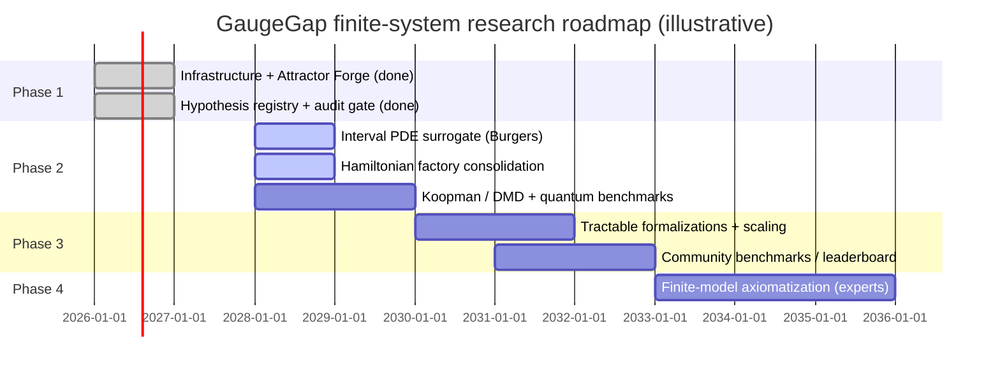
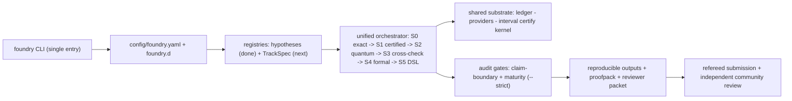

# Roadmap — high-impact, finite-system-first research program

> **Boundary:** This is a research and engineering roadmap, not a result. GaugeGap
> Foundry builds reproducible **finite-system** benchmarks and machine-checkable
> certificates. It is **not claiming** a continuum Yang–Mills mass-gap result, a
> resolution of the Navier–Stokes regularity question, or a settlement of the
> Riemann Hypothesis or any Millennium Prize problem. Every item below is scoped as
> finite-system evidence, a prototype scaffold, or a roadmap target that **requires
> independent expert review** before any stronger reading.

## 0. Why this document

The Millennium Prize problems demand rigorous, peer-reviewed arguments of great
depth, accepted by the community over years. Precedent (Poincaré via Ricci flow;
Fermat via modularity; Kepler via the Flyspeck *formal* proof) shows the modern bar:
publication in refereed venues, extensive cross-checking, and increasingly
machine-verification.

> **Boundary:** We honor that bar by aiming at *finite-system* milestones with
> attached certificates — not by claiming any prize problem is solved.

GaugeGap already has building blocks that touch these questions: certified linear
algebra (`rigorous/interval_arithmetic.py`), quantum-backend interfaces, validated
numerics, audit gates, and byte-reproducible proofpacks. This roadmap maps those
blocks onto high-impact targets and sequences the work.

## 1. Prize criteria and precedent (summary)

- A claimed result must be **published in a refereed venue** and survive ~2 years of
  community scrutiny before any award; the community must broadly accept it.
- Precedent breakthroughs took years of collaborative checking (Poincaré, Fermat),
  and the trend is toward computer-assisted and **formally verified** records
  (Kepler/Flyspeck in HOL Light + Isabelle).

> **Boundary:** The lesson is process, not shortcuts. Our contribution is rigorous,
> reproducible finite-system artifacts that an expert community can re-run — not a
> finished proof of any named problem.

## 2. Mapping GaugeGap capabilities to high-impact questions

| Question | GaugeGap fit | Honest scope |
|---|---|---|
| Yang–Mills mass-gap question | GaugeGap track: Z₂/SU(2)/SU(3) finite lattice Hamiltonians, certified eigenvalue enclosures, QPE/VQE backends | Bound the lowest nonzero eigenvalue of **small** lattice models with interval arithmetic; no continuum claim |
| Navier–Stokes regularity question | FlowGap track: validated ODE/attractor diagnostics; route to interval-validated PDE surrogates (Burgers) | Certified enclosures for **truncated/finite** models; not a regularity result |
| Complexity (P vs NP family) | CurveRank + Spectra/Verdict DSLs | At most encode hard instances and certify finite, model-restricted statements |
| Riemann Hypothesis | CurveRank certified finite-truncation spectral screening | Certified **negative** screening of finite operators; not progress on the hypothesis itself |
| Quantum simulation milestone | Provider adapters + QPE/VQE/QSVT | Certified finite simulations with error budgets; evidence, not proof |
| Formalized chaos | Attractor Forge (Lyapunov/Poincaré + divergence certificates) | Finite-horizon, machine-checkable inequalities only |

> **Boundary:** The natural fits are the Yang–Mills and Navier–Stokes *questions*,
> approached only through finite lattices and truncated flows. Other rows are
> exploratory and stay finite-system by construction.

## 3. Gaps and risks (and how we hold the line)

- **Theory gap.** The continuum theories are open; we do **not** expect to close
  them. We frame outputs as finite-system evidence, never as a proof of a named
  problem.
- **Scale.** Realistic lattices/grids are huge; current code handles tiny models.
  Progress comes from small models, certified bounds, and careful extrapolation
  flagged as a roadmap item.
- **Verification depth.** Formalizing continuous mathematics is hard; we target
  small, tractable lemmas (Picard–Lindelöf-style enclosures, discrete operator
  facts) rather than overstating coverage.
- **Hardware noise.** Quantum results are noisy evidence with error budgets, never a
  proof on their own.
- **Expertise + credibility.** We engage external PDE / mathematical-physics /
  formal-methods reviewers and keep every claim explicitly bounded.

> **Boundary:** Each risk is managed by *scoping down* to what a certificate can back
> — a finite-system, independent-review-ready artifact.

## 4. Phased roadmap (deliverable-driven)

- **Phase 1 (0–12 mo) — infrastructure + baseline artifacts.** Unified `foundry`
  CLI + config (done), master architecture doc (done), Attractor Forge finite-time
  diagnostics (done), the validated **hypothesis registry + fail-closed gate**
  (done). Publish small certified results (finite ODE enclosures, toy lattice
  eigenvalue bounds) with Lean/Coq certificates.
- **Phase 2 (1–3 yr) — core prototyping.** Interval-validated PDE surrogate (Burgers
  → toy Navier–Stokes), finish the Hamiltonian factory consolidation, Koopman/DMD
  tools, a small certified quantum-benchmark suite, and a first refereed submission
  on certified finite-system results.
- **Phase 3 (3–5 yr) — scaling + formal bridges.** Tractable formalizations (discrete
  flow existence/uniqueness, gauge Gauss-law facts), larger lattices via HPC with
  certified bounds, open community benchmarks/leaderboards.
- **Phase 4 (5+ yr) — toward prize-scale questions.** Begin rigorous finite-model
  axiomatizations and engage experts; only pursue the formal publication/scrutiny
  process if a genuinely refereeable finite-system result emerges.

> **Boundary:** Phases are sequenced so each ships a reproducible, audited artifact;
> none asserts a Millennium Prize problem is resolved.

## 5. Research programs and formalization targets

For each: new modules, tests, formal artifacts, and reproducible outputs.

- **Interval-validated ODE/PDE enclosures** — extend `rigorous/interval_arithmetic.py`
  with interval time-stepping; `flowgap` Burgers/toy-NS modules; tests vs analytic
  solutions; a finite contraction-mapping lemma in Lean; JSON + certificate outputs.
- **Rigorous spectral bounds** — verified Hermitian eigenvalue enclosures for finite
  lattice Hamiltonians (reuse `certify.certify_spectrum`); cross-check vs exact
  diagonalization on 2×2 lattices; certified bound tables.
- **Constructive finite existence facts** — formalize small, checkable statements
  (e.g. fixed-point counts/Jacobians of the Rössler/Lorenz finite models) with a
  proofpack bridging numerics to the certificate.
- **Certified quantum experiments** — QPE/VQE circuits for small gauge Hamiltonians
  with error budgets; reproducible counts + a certificate that the estimate lies in
  its error interval.
- **Koopman / DMD analysis** — estimate operator spectra from finite trajectories;
  validate on flows with known spectra; certified finite-horizon eigenvalue facts.
- **Experience / Experiment visualization** — the dependency-free audiovisual
  interface (`foundry-experience-0001`). Its two-mode split (immersive *Experience*
  vs parametric *Experiment*) is a **conceptual** nod to Ryoji Ikeda's
  *supersymmetry [experience]/[experiment]*; **no artwork, audio, data, or code from
  that installation is copied**, and no collaboration or endorsement is implied —
  attribution as inspiration only.

> **Boundary:** Every program emits a `pipeline.json` + proofpack + reviewer packet,
> byte-reproducible under fixed `SOURCE_DATE_EPOCH`; all outputs are finite-system
> evidence requiring independent review.

## 6. Governance, review, community

- **External advisory board** (PDE, mathematical physics, formal methods, quantum).
- **Open benchmarks / reproducibility leaderboard** with certified finite-system
  results others can re-run.
- **Pre-registration** of finite-system hypotheses (now backed by the validated
  `hypotheses/` registry) and transparent, open-licensed publication.
- **Workshops + open peer review**, shipping reviewer packets alongside submissions.

> **Boundary:** Credibility comes from openness and independent review, not from
> strong claim language.

## 7. Engineering checklist (reconciled with current `main`)

1. **Hypothesis + track registries** — hypothesis loader + fail-closed
   `foundry hypotheses --check` gate **done** (PR #83). Remaining: a track-agnostic
   `TrackSpec`/`unified_registry`, and progressively classifying discovered
   `script:*` units.
2. **Hamiltonian factory consolidation** — `hamiltonian_factory.build_hamiltonian` +
   `build_and_audit` + `HamiltonianArtifact.digest()` already exist on `main`.
   Remaining: route the legacy builders (`z2_chain.py`, `models/z2_plaquette.py`,
   `gaugegap_su2_pure.py`, `gaugegap_su3_*`) through it with **bit-identical**
   regression tests (`digest()` vs legacy output).
3. **Provider adapter unification** — collapse the IBM/Qiskit paths onto
   `providers/get_provider`; keep quantum regression tests green.
4. **Canonical certify API** — make `certify.certify_spectrum` the single entry
   point; delegate `curverank_certified.py`; byte-match test on a small Hamiltonian.
5. **Orphaned-module triage** — wire each kept quantum module into a `foundry run`
   demo + test, or mark it explicitly as prototype/scaffold (kept honest by the
   maturity audit).
6. **Determinism gates** — known-answer + byte-reproducibility CI on every track.
7. **Reproducible proofpacks** — capture new tracks, Lean/Coq sources, toolchain
   versions; re-verify certificates emit no `sorry`.

## 8. Master workflow (research → reproducible artifact → review)

> **Boundary:** The diagram embeds verification at every stage; the output is a
> finite-system, independent-review-ready artifact, not a prize claim.

## 9. Candidate questions — feasibility (honest)

| Question | Fit | Feasibility (finite-system milestones only) | Horizon |
|---|---|---|---|
| Yang–Mills mass-gap | Direct | Low–med: toy-lattice certified bounds are tractable | Long |
| Navier–Stokes regularity | Partial | Low: only truncated/finite certified enclosures | Long |
| Quantum simulation milestone | Strong | Medium: incremental certified finite sims | Medium |
| Formalized chaos | Strong | High: finite-horizon certificates, publishable | Short |
| Riemann Hypothesis | Marginal | Very low: certified finite-truncation negative screening only | Exploratory |
| P vs NP family | Low | Very low: model-restricted finite statements at most | Open-ended |

> **Boundary:** "Feasibility" refers strictly to finite-system milestones with
> certificates — not to settling the underlying open question.

## 10. Key references and immediate actions

**References:** Clay Mathematics Institute problem descriptions (Yang–Mills,
Navier–Stokes); Jaffe–Witten problem formulation; Hales et al., the Flyspeck *formal*
proof of the Kepler conjecture; expositions of the Poincaré verification process;
recent lattice-gauge quantum-simulation papers; literature on reproducible,
machine-checked mathematics.

**Immediate actions (next steps):**
1. Annotated bibliography on finite-system rigor for the two natural questions.
2. Flesh out `hypotheses/*.yaml` targets as precise finite-system statements (now
   validated by the registry gate).
3. Prototype an interval integrator for the Rössler/Lorenz finite models.
4. Route legacy gauge builders through `hamiltonian_factory` with `digest()`
   regression tests.
5. Stand up a formal-methods workstream for small Lean/Coq lemmas tied to the
   pipeline.

> **Boundary:** These actions produce finite-system, independently reviewable
> artifacts. Nothing here is, or claims to be, a proof of a Millennium Prize problem.
