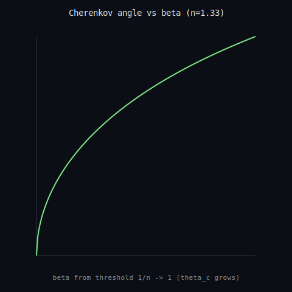

# Cherenkov radiation: local speed limit & cone

A charged particle faster than light-in-medium (`beta > 1/n`) outruns the spherical wavefronts it emits, which pile into a cone with `cos(theta_c) = 1/(n beta)` -- the velocity<->geometry edge of the physical-limits web (a local speed limit c/n with an exact geometric signature). The wavefront pile-up is simulated and the cone angle recovered from the point cloud to err 3.2e-06; a discharged Lean 4 / Coq certificate proves the cone cosine is valid (`0 < cos theta_c <= 1`) at/above threshold. **Claim boundary:** a finite exact EM/geometry demo; NOT a detector reproduction (RICH / Super-Kamiokande) and the spectral 'blue' weighting is not modelled; the cone relation and threshold are exact theorems. Not a continuum/Millennium claim.

- threshold beta = 1/n = **0.752**; emits = **True**
- cos(theta_c) = 1/(n beta) = **0.8354** -> theta_c = **33.34 deg**
- recovered from wavefronts = **0.8354** (err 3.2e-06); certificate hole-free = **True**

_Generated by `scripts/run_cherenkov.py`._
