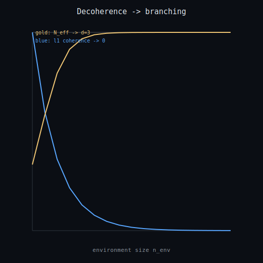

# Decoherence and branching

A quantum superposition is a single coherent state -- a web of weighted possibilities (the Born weights). When an environment records which pointer state the system is in, the off-diagonal coherences decay (decoherence) and the system behaves like a set of classical branches (einselection). Here a d=3 pointer decoheres as `n_env` environment registers record it: the l1 coherence falls to ~0 and the effective branch count `N_eff = 1/Tr(rho^2)` rises from 1 (one coherent state) to d (d branches), with a discharged Lean 4 / Coq certificate that `1 <= N_eff <= d`. The analytic reduced state is validated against an explicit statevector partial trace (max difference 1.1e-16). **Claim boundary:** a finite exact model of a physical *mechanism*; it makes NO metaphysical claim and says nothing about the existence or nature of any creator / deity / 'the universe as a whole'. Dependency-light (numpy). Not a continuum/Millennium claim.

- effective branches N_eff = **3.0000** (certified in [1, 3] = **True**)
- l1 coherence at n_env=12 = **4.3536e-03**, Born weights sum = **1.000000**
- certificate hole-free = **True**

_Generated by `scripts/run_decoherence_branching.py`._
