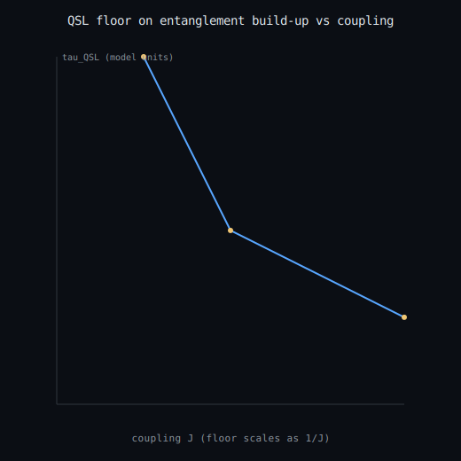

# Quantum speed limit on entanglement formation

A finite two-qubit exchange model builds entanglement over a finite time. The Mandelstam-Tamm and Margolus-Levitin **quantum speed limits** give a rigorous lower bound (floor) on that time; here the exchange evolution saturates the floor (entanglement forms as fast as quantum mechanics allows), and a discharged Lean 4 / Coq certificate proves the build-up time respects `max(tau_MT, tau_ML)`. **Claim boundary:** a finite-model demonstration inspired by attosecond-entanglement work; the QSL inequalities are exact and machine-checked on the simulated evolution; NOT a reproduction of the helium experiment or the ~232 as figure; physical-time conversion is illustrative only.

- build-up time = **0.2986 model**
- QSL floor = **0.2986 model** (MT 0.2986, ML 0.2986)
- respects QSL = **True**, certificate hole-free = **True**

_Generated by `scripts/run_entanglement_speed_limit.py`._
