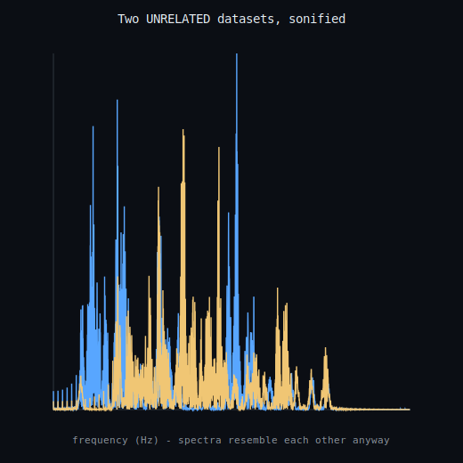
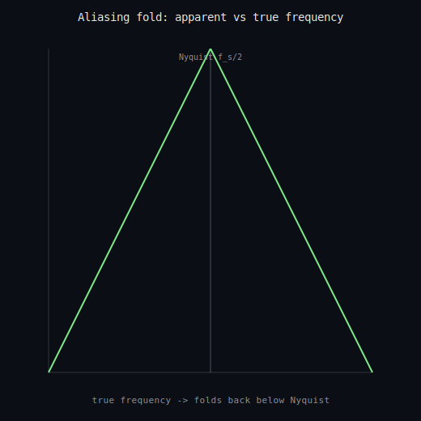

# Sonification & the sampling limit

The honest core behind "LHC data sounds like Saturn's rings". Sonification (CERN's LHCsound, NASA's Chandra/Cassini) maps data to audio -- a real, useful technique -- but it is a **mapping**, not physics. Two **independent** datasets, sonified with the same band-limited mapping, score **0.33** spectral cosine similarity (vs the self-similarity control of 1.00); high resemblance between unrelated data means *auditory similarity is not evidence of a shared source*. The rigorous, certifiable content is the **Nyquist-Shannon sampling limit**: a tone above the Nyquist frequency (4000 Hz) folds to an in-band impostor (5200 Hz -> 2800 Hz), with a discharged Lean 4 / Coq certificate of the fold `f_s/2 < f < f_s => 0 < f_s - f < f_s/2`. **Claim boundary:** a finite, exact signal-processing demonstration; there is no special LHC<->Saturn link; the sampling/aliasing statements are exact Fourier theorems. Not a continuum/Millennium claim.

- Nyquist = 4000 Hz; content within band = True
- aliasing fold 5200 Hz -> 2800 Hz; certificate hole-free = True
- unrelated-pair spectral similarity = **0.327** (spurious resemblance)

_Generated by `scripts/run_sonification.py`._
