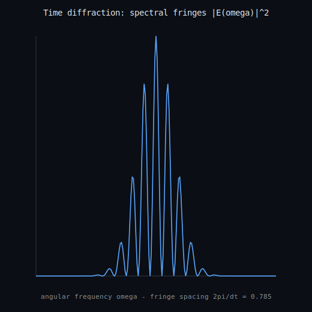

# Temporal double-slit (time diffraction)

Two **time slits** (short windows in time, separation `dt`) make a probe interfere in the **frequency** spectrum, with fringe spacing `Delta_omega = 2 pi / dt` -- exact time-frequency Fourier duality (the time<->energy currency of the physical-limits web). Recovering the slit separation from the fringes reproduces `dt` to < 1e-03 relative error across a sweep, and a discharged Lean 4 / Coq certificate proves the time-bandwidth bound `sigma_t sigma_omega >= 1/2` (the Fourier-dual sibling of the Mandelstam-Tamm speed limit). **Claim boundary:** a finite, exact Fourier simulation of the time-diffraction principle; NOT a reproduction of the ITO thin-film experiment (Tirole, Vezzoli et al., Nat. Phys. 2023) or its numbers; the time-bandwidth inequality is an exact Fourier theorem. Not a continuum/Millennium claim.

- fringe spacing 2pi/dt = **0.7854** (dt=8.0)
- separation recovered from fringes = **8.0098** (rel err 1.2e-03)
- time-bandwidth product = **0.5000** (>= 1/2: **True**), certificate hole-free = **True**

_Generated by `scripts/run_temporal_double_slit.py`._
